# Урок 2. Введение в Blender

**Курс:** Разработка 3D моделей и визуальных эффектов
**Версия программы:** Blender 4.3 и новее

Эта лекция повторяет то, что мы делали на уроке. Если ты пропустил занятие или что-то забыл, пройди её по порядку с открытым Blender: читаешь абзац, смотришь GIF, сразу повторяешь руками. На всё уйдёт около часа.

> **★ Звёздочка** отмечает дополнительный материал. При первом прохождении его можно пропускать, он пригодится позже. Всё, что без звёздочки, нужно для домашнего задания.

## Содержание

0. [Перед началом](#0-перед-началом)
1. [Самое базовое: выделение, копия, удаление, отмена](#1-самое-базовое)
2. [Трансформации: перемещение, вращение, масштаб](#2-трансформации)
3. [Навигация по сцене](#3-навигация-по-сцене)
4. [Режимы и из чего состоит модель](#4-режимы-и-из-чего-состоит-модель)
5. [3D-курсор](#5-3d-курсор)
6. [Создание примитивов](#6-создание-примитивов)
7. [Задание: собери уровень из игры](#7-задание-собери-уровень-из-игры)
8. [Если что-то не работает](#8-если-что-то-не-работает)
9. [Шпаргалка по клавишам](#9-шпаргалка-по-клавишам)

---

## 0. Перед началом

### Сокращения

| Сокращение | Значение |
|---|---|
| ЛКМ | левая кнопка мыши |
| ПКМ | правая кнопка мыши |
| СКМ | средняя кнопка мыши (нажатие на колёсико) |
| Num | клавиша на цифровом блоке клавиатуры (numpad), например `Num 1` |

Названия команд даны на двух языках: **English (Русский)**. Интерфейс Blender у тебя может быть на любом из них.

### Два правила, без которых клавиши не работают

1. **Раскладка клавиатуры должна быть английская (EN).** На русской раскладке горячие клавиши не срабатывают.
2. **Курсор мыши должен находиться над окном 3D Viewport (3D-вьюпорт).** Это большое окно со сценой в центре экрана. Blender отправляет нажатие в то окно, над которым сейчас мышь. Если мышь над списком объектов или панелью свойств, клавиша сделает что-то другое или ничего.

### Если у тебя ноутбук без numpad

Открой **Edit → Preferences → Input → Emulate Numpad** (Правка → Настройки → Ввод → Эмуляция цифрового блока) и поставь галочку. После этого цифры верхнего ряда клавиатуры работают как numpad.

Учти одно последствие: в режиме редактирования клавиши `1` / `2` / `3` перестанут переключать вершины, рёбра и грани. Вместо них пользуйся тремя кнопками в шапке вьюпорта (см. [раздел 4](#4-режимы-и-из-чего-состоит-модель)).

<!-- 🎬 GIF-01 ЗАПИСАТЬ: Edit → Preferences → Input → включить Emulate Numpad, затем нажать 1 и 3 в верхнем ряду, вид меняется -->
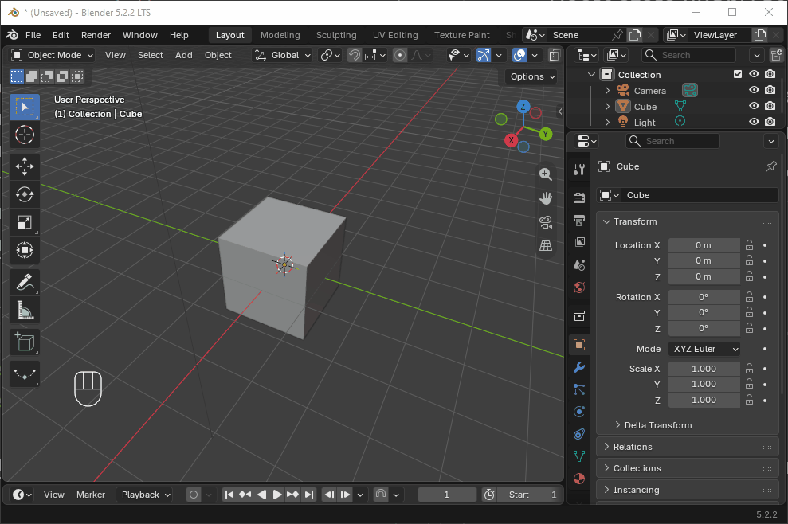

---

## 1. Самое базовое

При запуске Blender в сцене уже есть три объекта: куб, камера и источник света. На них и потренируемся.

### Выделение

Кликни по объекту **ЛКМ**, вокруг него появится оранжевая обводка. Это значит, что объект выделен и все следующие команды будут применяться к нему.

Чтобы выделить несколько объектов, кликай по ним с зажатым **Shift**. Клавиша **A** выделяет всё в сцене, **Alt + A** снимает выделение со всего.

| Клавиша | English | Русский | Что делает |
|---|---|---|---|
| `ЛКМ` | Select | Выделить | Выделить объект |
| `Shift` + `ЛКМ` | Extend Selection | Добавить к выделению | Выделить несколько объектов |
| `A` | Select All | Выделить всё | |
| `Alt` + `A` | Deselect All | Снять выделение | |

<!-- 🎬 GIF-02 ЗАПИСАТЬ: клик ЛКМ по кубу, Shift+ЛКМ по камере и свету, затем Alt+A, затем A -->
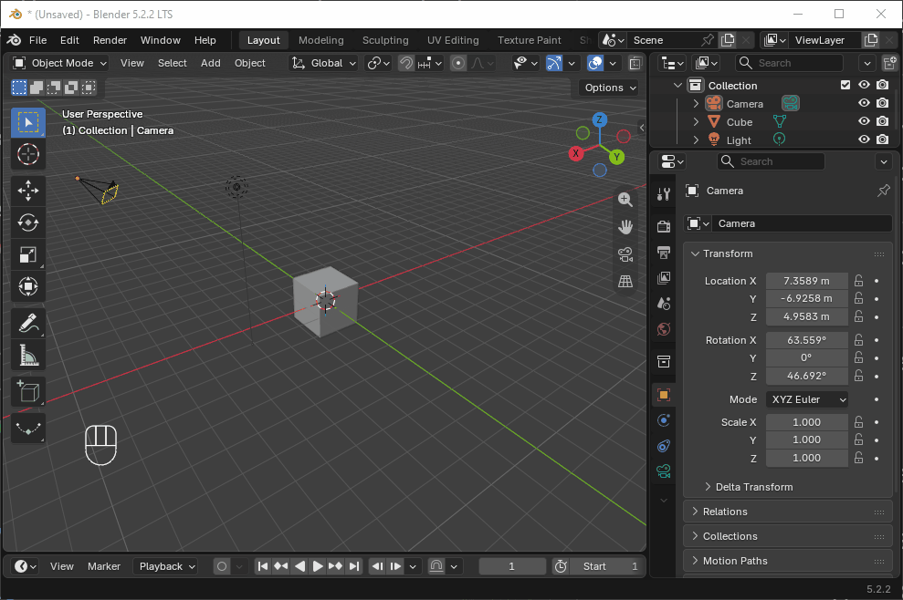

### Копия, удаление, отмена, сохранение

**Shift + D** создаёт копию выделенного объекта, и она сразу «прилипает» к мыши: подвинь её и кликни ЛКМ, чтобы поставить на место. Если нажать ПКМ, копия всё равно создастся, но останется ровно внутри оригинала. Так в сцене появляются невидимые двойники, поэтому после `Shift + D` всегда отодвигай копию.

**X** или **Delete** удаляет объект. При нажатии `X` появится маленькое меню, подтверди удаление кликом.

**Ctrl + Z** отменяет последнее действие. Ошибаться не страшно: почти всё можно откатить.

**Ctrl + S** сохраняет файл. Сохраняйся почаще. Blender иногда вылетает, и восстановить несохранённую работу получается не всегда.

| Клавиша | English | Русский | Что делает |
|---|---|---|---|
| `Shift` + `D` | Duplicate | Дублировать | Копия объекта, сразу можно двигать |
| `X` или `Delete` | Delete | Удалить | |
| `Ctrl` + `Z` | Undo | Отменить | Шаг назад |
| `Ctrl` + `S` | Save | Сохранить | |

<!-- 🎬 GIF-03 ЗАПИСАТЬ: Shift+D на кубе, отодвинуть копию, ЛКМ; затем X → Delete; затем Ctrl+Z, куб возвращается -->
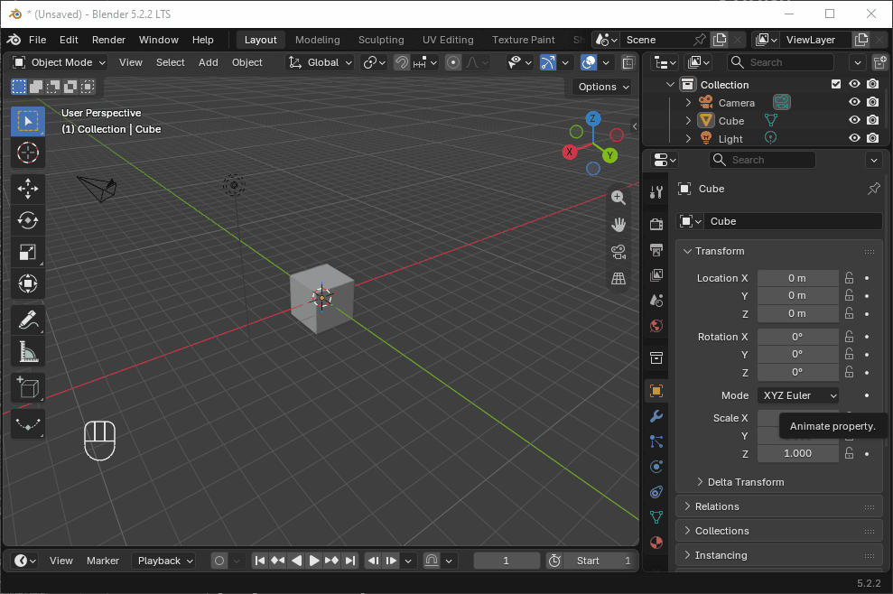

---

## 2. Трансформации

**Transform (Трансформация)** это три действия, которыми ты будешь пользоваться постоянно: перемещение, вращение и масштаб.

| Клавиша | English | Русский | Что делает |
|---|---|---|---|
| `G` | Grab / Move | Перемещение | Двигать объект за мышью |
| `R` | Rotate | Вращение | Поворачивать объект |
| `S` | Scale | Масштаб | Увеличивать / уменьшать объект |

Все три работают одинаково:

1. Выдели объект.
2. Нажми клавишу **один раз и отпусти**. Зажимать её и зажимать кнопки мыши не нужно.
3. Двигай мышь, объект меняется.
4. **ЛКМ** или **Enter** подтверждает результат. **ПКМ** или **Esc** отменяет, и объект возвращается как был.

<!-- 🎬 GIF-04 ЗАПИСАТЬ: G — подвигать куб, ЛКМ. Желательно с включённым отображением нажатых клавиш (Screencast Keys) -->
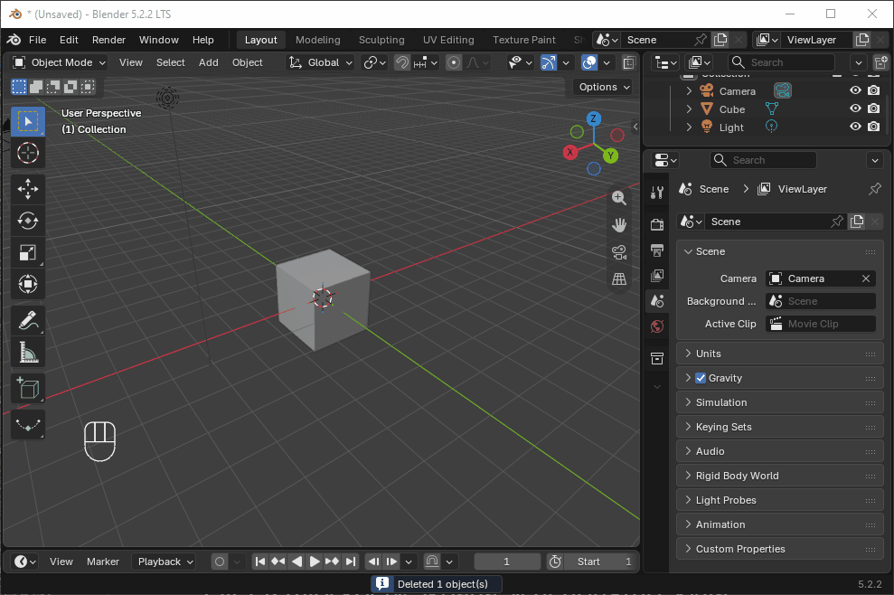

<!-- 🎬 GIF-05 ЗАПИСАТЬ: R — повернуть куб, ЛКМ -->
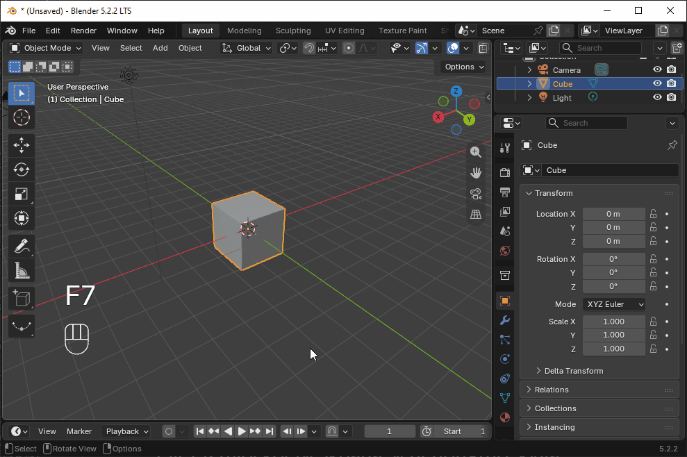

<!-- 🎬 GIF-06 ЗАПИСАТЬ: S — увеличить и уменьшить куб, ЛКМ -->
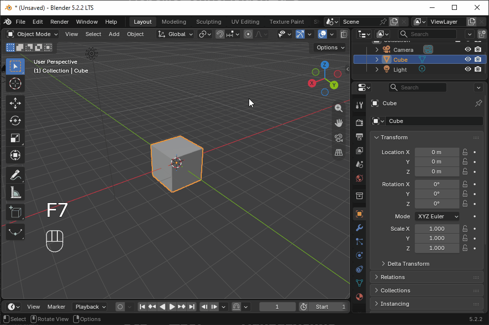

<!-- 🎬 GIF-07 ЗАПИСАТЬ: G, увести куб далеко, нажать ПКМ — куб вернулся на место -->

### Ограничение по осям

Если просто нажать `G` и двигать мышь, объект едет в плоскости экрана, и непонятно, куда именно он уехал в глубину. Поэтому почти всегда движение ограничивают одной осью: **Axis Constraint (Ограничение по оси)**.

В Blender три оси, у каждой свой цвет:

| Ось | Цвет | Направление |
|---|---|---|
| X | красная | влево / вправо |
| Y | зелёная | вперёд / назад |
| Z | синяя | вверх / вниз |

После `G`, `R` или `S` нажми букву оси. На экране появится цветная линия, и объект будет двигаться только вдоль неё.

- `G` `Z` поднять или опустить объект
- `G` `X` сдвинуть вбок
- `R` `Z` повернуть вокруг вертикальной оси, как на вращающемся стуле
- `S` `Z` вытянуть в высоту, не меняя ширину

<!-- 🎬 GIF-08 ЗАПИСАТЬ: G Z (синяя линия, куб вверх-вниз), ЛКМ; G X (красная линия); S Z — куб вытягивается в столб -->

### Точные значения

После клавиши и оси можно набрать число на клавиатуре и нажать `Enter`. Мышь при этом трогать не нужно.

| Нажать | Результат |
|---|---|
| `G` `Z` `2` `Enter` | вверх на 2 метра |
| `G` `X` `-3` `Enter` | на 3 метра в обратную сторону по X |
| `R` `Z` `90` `Enter` | поворот на 90° вокруг вертикали |
| `S` `2` `Enter` | в 2 раза больше |
| `S` `0.5` `Enter` | в 2 раза меньше |

Набранное число видно в левом верхнем углу вьюпорта.

<!-- 🎬 GIF-09 ЗАПИСАТЬ: G Z 2 Enter; R Z 90 Enter (лучше на вытянутом объекте, чтобы поворот был заметен); S 2 Enter. В кадре должна быть видна строка с числом в шапке вьюпорта -->
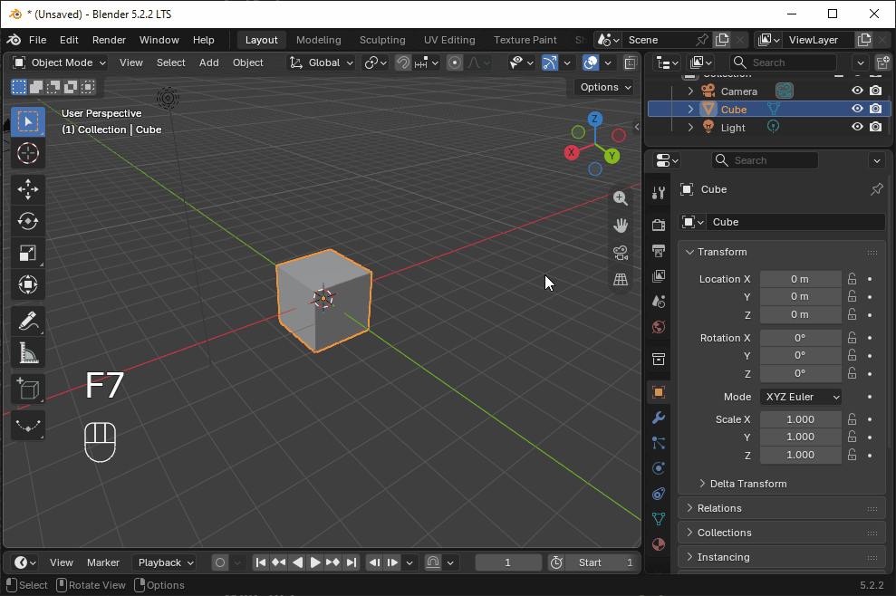

### Сводная таблица

| После `G` / `R` / `S` | Что делает | Пример |
|---|---|---|
| `X` / `Y` / `Z` | Только вдоль одной оси | `G` `Z` поднять / опустить |
| Ввести число | Точное значение | `G` `Z` `2`, `R` `Z` `90`, `S` `2` |
| `ЛКМ` / `Enter` | Confirm (Подтвердить) | |
| `ПКМ` / `Esc` | Cancel (Отменить) | Объект вернётся на место |
| ★ `X` `X` (дважды) | Вдоль локальной оси объекта: Local (Локальная) | Двигать повёрнутый объект «вперёд» |
| ★ `Shift` + `Z` | По всем осям, кроме Z | `G` `Shift+Z` двигать по полу |
| ★ Зажать `Ctrl` | Snapping (Привязка): движение шагами по сетке | |
| ★ `Alt` + `G` / `R` / `S` | Clear Location / Rotation / Scale (Сбросить положение / вращение / масштаб) | Вернуть «как было» |

### ★ Дополнительно

**Движение по полу.** `G`, затем `Shift + Z` запрещает ось Z и оставляет две остальные. Объект скользит по горизонтали и не взлетает. Удобно расставлять ящики и дома.

**Локальные оси.** Если объект повёрнут, его собственные оси уже не совпадают с осями мира. Нажми букву оси дважды (`G` `X` `X`), и объект поедет вдоль своей оси, а не мировой.

<!-- 🎬 GIF-10 ЗАПИСАТЬ ★: G Shift+Z — куб скользит по полу; затем повернуть куб на 45° по Z, показать G X (едет по мировой оси) и G X X (едет вдоль своей) -->
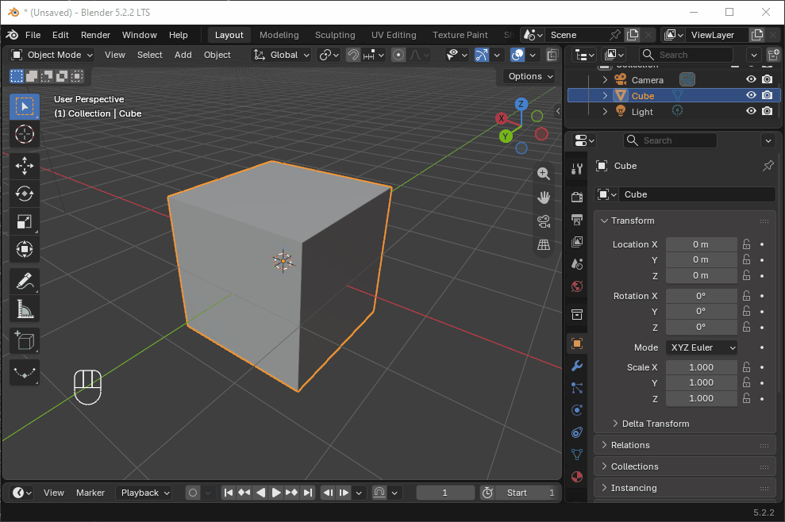

**Сброс.** `Alt + G` возвращает объект в центр мира, `Alt + R` убирает поворот, `Alt + S` возвращает исходный размер.

<!-- 🎬 GIF-11 ЗАПИСАТЬ ★: сдвинутый, повёрнутый и увеличенный куб; по очереди Alt+G, Alt+R, Alt+S -->
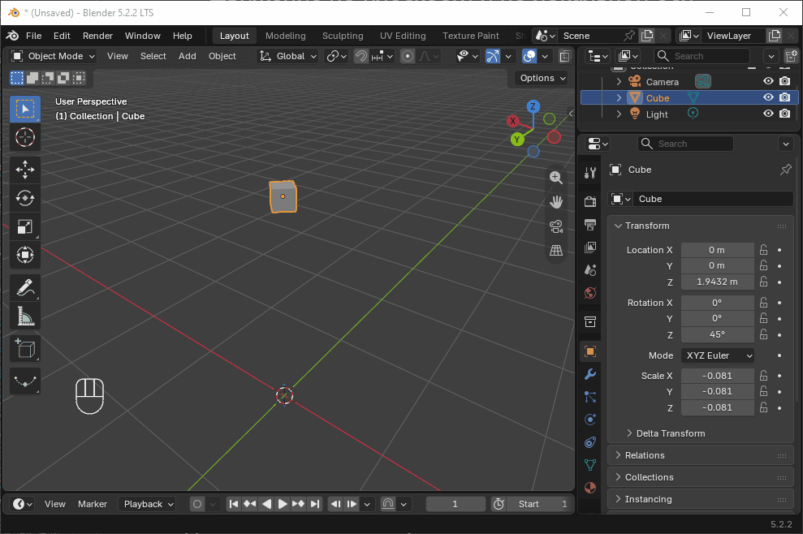

**Боковая панель.** Клавиша `N` открывает **Sidebar (Боковая панель)**. На вкладке **Item (Элемент)** видны точные значения **Location (Положение)**, **Rotation (Вращение)** и **Scale (Масштаб)**, их можно править прямо там.

<!-- 🎬 GIF-12 ЗАПИСАТЬ ★: N — открыть панель, вкладка Item, вписать значение в Location Z, куб сдвигается -->
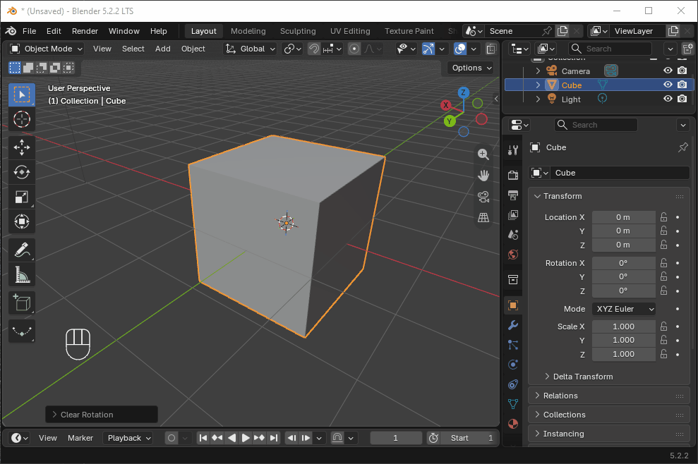

### Проверь себя

Не подглядывая в таблицу:

1. Подними куб на 3 метра.
2. Поверни его на 45° вокруг вертикальной оси.
3. Сделай его в 2 раза шире по оси X.
4. Начни двигать куб и отмени движение.

Ответы

1. `G` `Z` `3` `Enter`
2. `R` `Z` `45` `Enter`
3. `S` `X` `2` `Enter`
4. `G`, подвигать мышь, `ПКМ` или `Esc`

---

## 3. Навигация по сцене

Трансформации меняют объект. Навигация меняет только твою точку зрения, объекты при этом остаются на месте. Почти всё здесь делается средней кнопкой мыши.

| Клавиша | English | Русский | Что делает |
|---|---|---|---|
| Зажать `СКМ` + двигать мышь | Orbit | Вращение вида (по орбите) | Облететь сцену вокруг центра |
| `Shift` + `СКМ` | Pan | Панорамирование | Сдвинуть вид вбок / вверх |
| Колёсико или `Ctrl` + `СКМ` | Zoom | Масштабирование вида | Приблизить / отдалить |

<!-- 🎬 GIF-13 ЗАПИСАТЬ: орбита СКМ, затем Shift+СКМ, затем зум колёсиком. В сцене лучше несколько объектов, чтобы было видно движение камеры -->
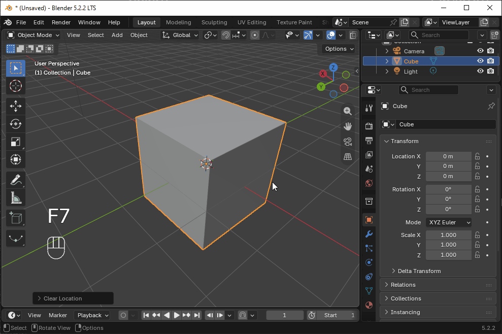

### Как не потеряться

Рано или поздно ты улетишь камерой так, что объектов не видно, или зум перестанет приближать. Это случается со всеми. Помогают две клавиши:

| Клавиша | English | Русский | Что делает |
|---|---|---|---|
| `Num .` (точка) | View Selected | Показать выделенное | Приблизить вид к выделенному объекту и вращаться вокруг него |
| `Home` | Frame All | Показать всё | Показать все объекты сцены |

`Num .` стоит нажимать каждый раз, когда начинаешь работать с новым объектом: после неё орбита крутится именно вокруг него.

То же самое есть в меню: **View → Frame Selected** (Вид → Показать выделенное).

<!-- 🎬 GIF-14 ЗАПИСАТЬ: улететь далеко от сцены, нажать Home — видно всё; выделить маленький объект, Num . — вид приблизился, орбита вокруг него -->
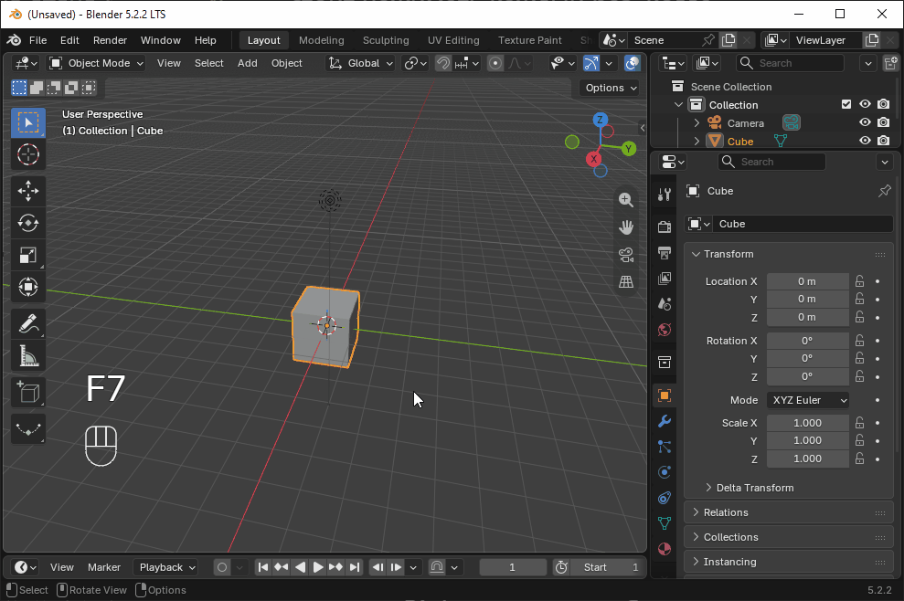

### Виды строго спереди, сбоку, сверху

Ровно расставлять объекты удобнее, когда смотришь точно вдоль оси.

| Клавиша | English | Русский |
|---|---|---|
| `Num 1` | Front | Спереди |
| `Num 3` | Right | Справа |
| `Num 7` | Top | Сверху |
| `Ctrl` + `Num 1` / `3` / `7` | Back / Left / Bottom | Сзади / Слева / Снизу |
| ★ `Num 5` | Perspective / Orthographic | Перспектива / Ортография |
| ★ `Num 0` | Camera | Вид из камеры |
| ★ `~` (тильда) | View Pie Menu | Круговое меню видов |

<!-- 🎬 GIF-15 ЗАПИСАТЬ: Num 1, Num 3, Num 7, Ctrl+Num 1; в кадре видна подпись вида в левом верхнем углу вьюпорта -->
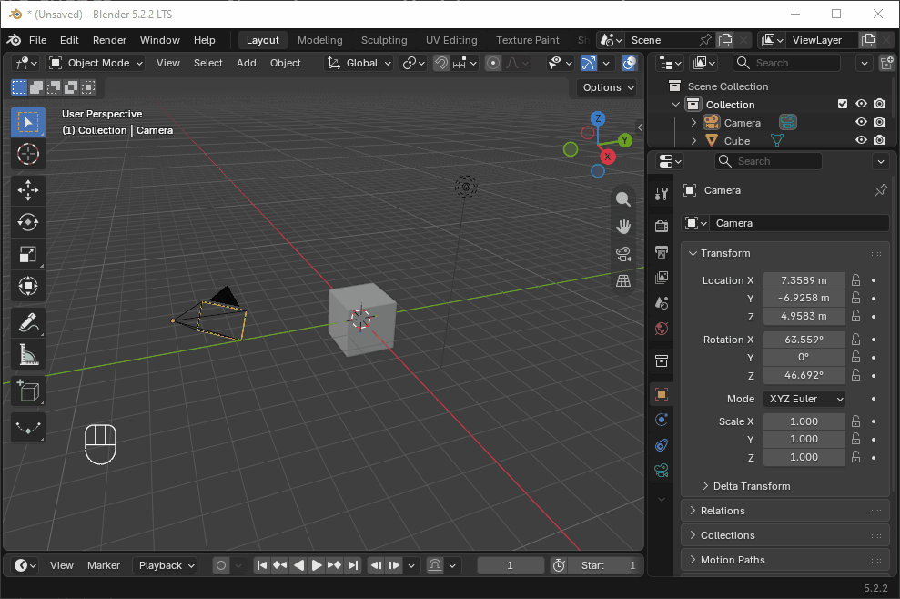

### ★ Дополнительно

**Перспектива и ортография.** В перспективе дальние объекты выглядят меньше, как в жизни. В ортографии размер не зависит от расстояния, параллельные линии остаются параллельными, как на чертеже. `Num 5` переключает одно на другое. Когда ты нажимаешь `Num 1` / `3` / `7`, Blender сам включает ортографию.

**Круговое меню видов.** Клавиша `~` (под `Esc`) открывает меню, в котором вид выбирается мышью. Полезно, если нет numpad.

<!-- 🎬 GIF-16 ЗАПИСАТЬ ★: Num 5 туда-обратно на сцене с несколькими объектами на разной дальности; затем ~ и выбор вида в круговом меню; Num 0 — вид из камеры -->
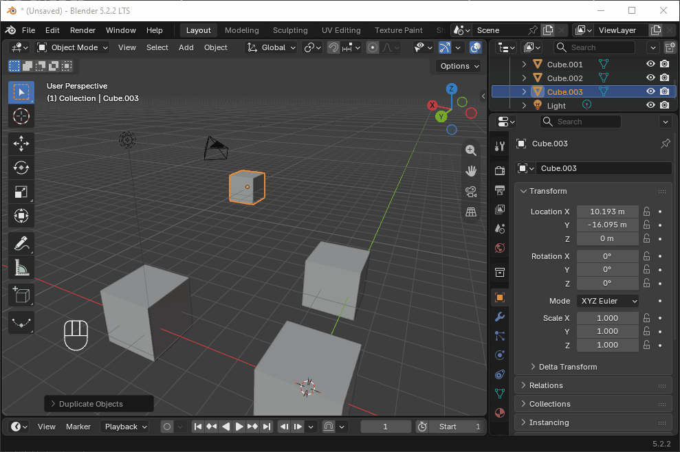

**Гизмо навигации.** В правом верхнем углу вьюпорта находится **Navigation Gizmo (Гизмо навигации)**. Им можно делать всё то же самое одной мышью:

- тянуть за шар с осями: вращение по орбите;
- клик по кружку X / Y / Z: вид вдоль этой оси;
- иконка руки (Pan): зажать и тянуть, вид сдвигается;
- иконка лупы (Zoom): зажать и тянуть, вид приближается;
- иконка камеры: вид из камеры;
- иконка сетки: перспектива / ортография.

<!-- 🎬 GIF-17 ЗАПИСАТЬ ★: крупно правый верхний угол — потянуть за шар, клик по Z, потянуть руку, потянуть лупу, клик по сетке -->
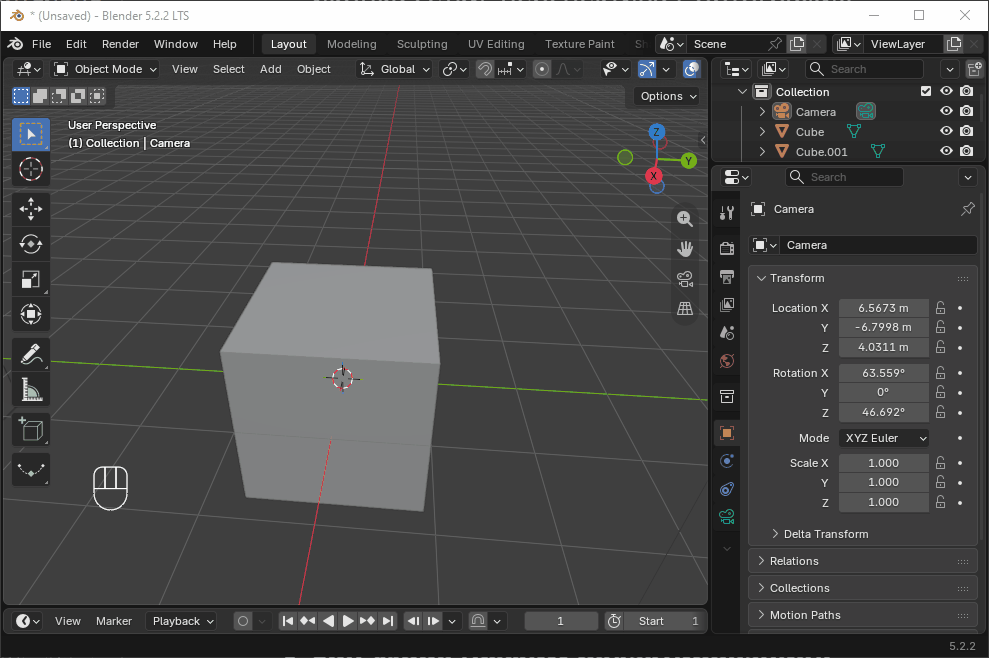

---

## 4. Режимы и из чего состоит модель

До сих пор мы работали с объектом целиком. Чтобы изменить его форму, нужно зайти «внутрь».

### Два главных режима

- **Object Mode (Объектный режим):** работа с объектами целиком. Двигаем, копируем, удаляем.
- **Edit Mode (Режим редактирования):** работа с частями одного объекта. Меняем его форму.

| Клавиша | English | Русский | Что делает |
|---|---|---|---|
| `Tab` | Object Mode ↔ Edit Mode | Объектный режим ↔ Режим редактирования | Переключение туда и обратно |
| ★ `Ctrl` + `Tab` | Mode Pie Menu | Круговое меню режимов | Выбрать любой режим |
| Выпадающий список в левом верхнем углу вьюпорта | Mode | Режим | То же самое через интерфейс |

Перед нажатием `Tab` объект должен быть выделен. Понять, в каком ты режиме, можно по списку в левом верхнем углу вьюпорта и по виду объекта: в Edit Mode на нём видны точки и линии.

<!-- 🎬 GIF-18 ЗАПИСАТЬ: выделить куб, Tab — видны вершины и рёбра, Tab обратно; затем то же через выпадающий список Mode -->
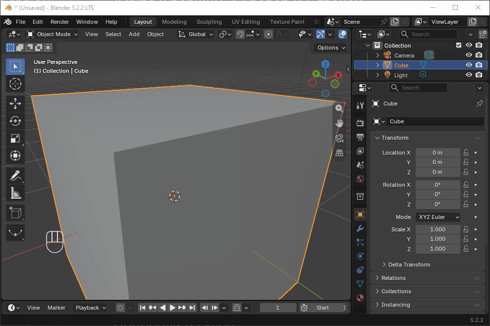

### Из чего состоит 3D-модель

Любая модель в Blender это **Mesh (Меш)**, сетка из трёх видов элементов:

| Клавиша (в Edit Mode) | English | Русский | Что это |
|---|---|---|---|
| `1` | Vertex | Вершина | Точка в пространстве |
| `2` | Edge | Ребро | Отрезок, соединяющий две вершины |
| `3` | Face | Грань (полигон) | Плоскость, ограниченная 3 и более рёбрами |

У куба 8 вершин, 12 рёбер и 6 граней.

Клавиши `1` / `2` / `3` переключают, что именно ты выделяешь кликом. Те же три переключателя есть кнопками в шапке вьюпорта, справа от списка режимов. Если у тебя включён Emulate Numpad, пользуйся кнопками.

<!-- 🎬 GIF-19 ЗАПИСАТЬ: в Edit Mode нажать 1 и кликнуть вершину, 2 и кликнуть ребро, 3 и кликнуть грань; показать, что кнопки в шапке переключаются вместе с клавишами -->
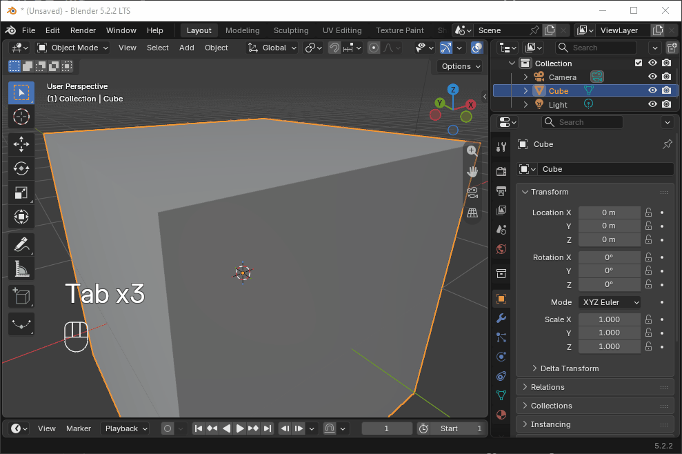

### Меняем форму

Главное, что нужно запомнить: **в Edit Mode работают те же `G`, `R`, `S`**, с теми же осями и числами. Только применяются они к выделенным вершинам, рёбрам или граням.

Попробуй на кубе:

1. Выдели куб, нажми `Tab`.
2. Нажми `3` (режим граней) и кликни по верхней грани.
3. `G` `Z` `1` `Enter`. Куб вытянулся вверх на метр.
4. `S` `0` `Enter`. Верхняя грань стянулась в точку, получилась пирамида.
5. Нажми `Tab`, чтобы вернуться в Object Mode.

<!-- 🎬 GIF-20 ЗАПИСАТЬ: ровно шаги 1–5 выше: Tab, 3, клик по верхней грани, G Z 1, S 0, Tab -->
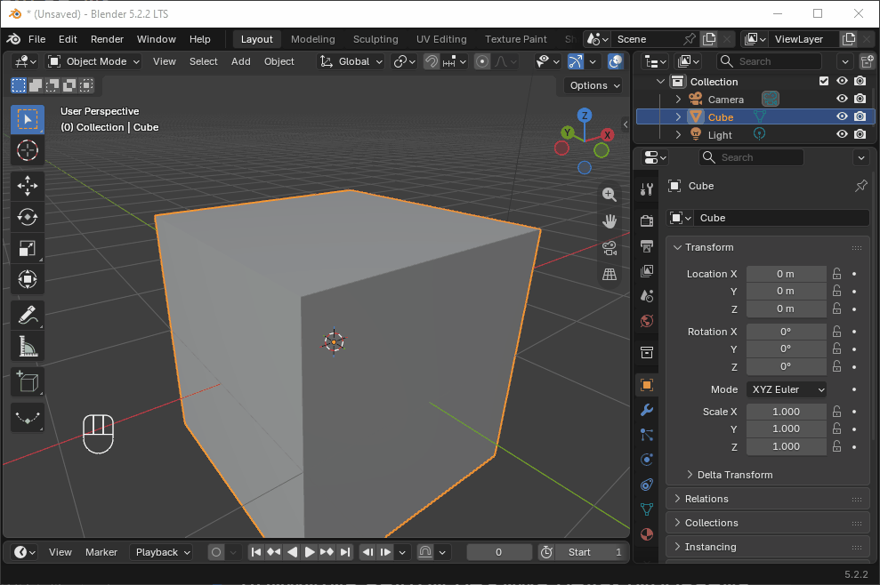

> Не забывай выходить из Edit Mode. Если нажать `Shift + A` и добавить новый примитив внутри режима редактирования, он станет частью текущего объекта, а не отдельным объектом.

---

## 5. 3D-курсор

На сцене есть красно-белый кружок с перекрестьем. Это **3D Cursor (3D-курсор)**. Не путай его с курсором мыши.

Его главное назначение: **все новые объекты появляются в точке 3D-курсора**. Поставь курсор туда, где нужен объект, и добавляй.

| Клавиша | English | Русский | Что делает |
|---|---|---|---|
| `Shift` + `ПКМ` | Set 3D Cursor | Установить 3D-курсор | Поставить курсор в точку клика. Если зажать и тянуть, курсор скользит по поверхностям объектов |
| `Shift` + `C` | Center Cursor and Frame All | Центрировать курсор и показать всё | Вернуть курсор в центр мира (0, 0, 0) |

<!-- 🎬 GIF-21 ЗАПИСАТЬ: Shift+ПКМ в нескольких местах; Shift+ПКМ с зажатием — провести курсором по поверхности куба; Shift+C — курсор в центре -->
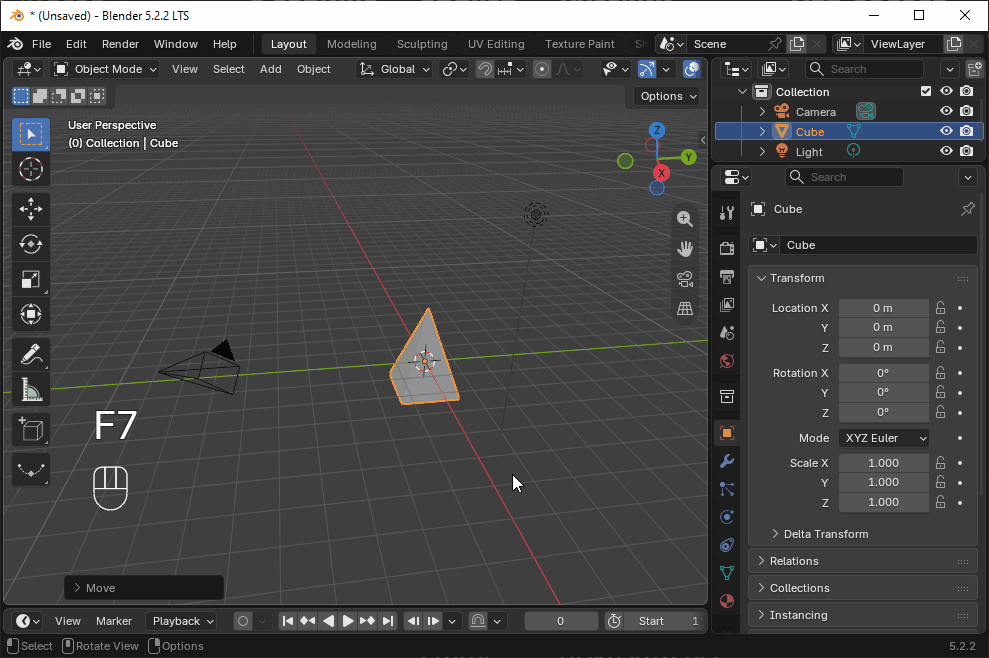

### ★ Дополнительно: меню привязки

`Shift + S` открывает **Snap Pie Menu (Круговое меню привязки)**. Три самых полезных пункта:

| Пункт меню | Русский | Что делает |
|---|---|---|
| Cursor to Selected | Курсор к выделенному | Курсор в центр выделенного объекта или элемента |
| Cursor to World Origin | Курсор в начало координат | Курсор в точку 0, 0, 0 |
| Selection to Cursor | Выделенное к курсору | Перенести объект в точку курсора |

Типичный приём: в Edit Mode выдели верхнюю грань башни, `Shift + S` → Cursor to Selected, выйди в Object Mode и добавь конус. Крыша появится ровно на верхушке.

<!-- 🎬 GIF-22 ЗАПИСАТЬ ★: цилиндр-башня, Tab, выделить верхнюю грань, Shift+S → Cursor to Selected, Tab, Shift+A → Cone — конус появился на верхушке -->
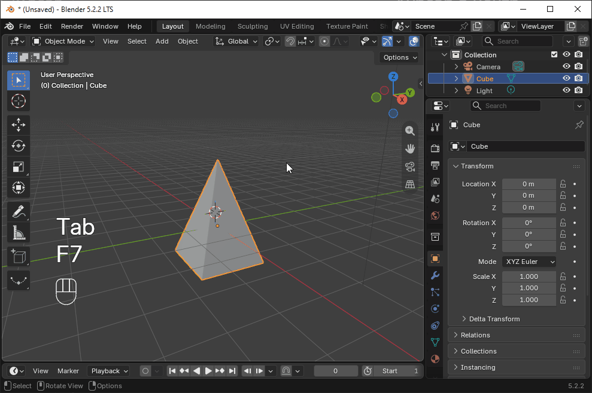

Точные координаты курсора: `N` → вкладка **View (Вид)** → **3D Cursor (3D-курсор)**.

---

## 6. Создание примитивов

Примитивы это готовые простые фигуры, из которых собирают всё остальное.

`Shift + A` открывает меню **Add (Добавить)** → **Mesh (Меш)** → выбери фигуру. То же меню Add есть в шапке вьюпорта. Объект появится в точке 3D-курсора.

<!-- 🎬 GIF-23 ЗАПИСАТЬ: поставить 3D-курсор в сторону от центра, Shift+A → Mesh → Cylinder; затем переставить курсор и добавить UV Sphere -->
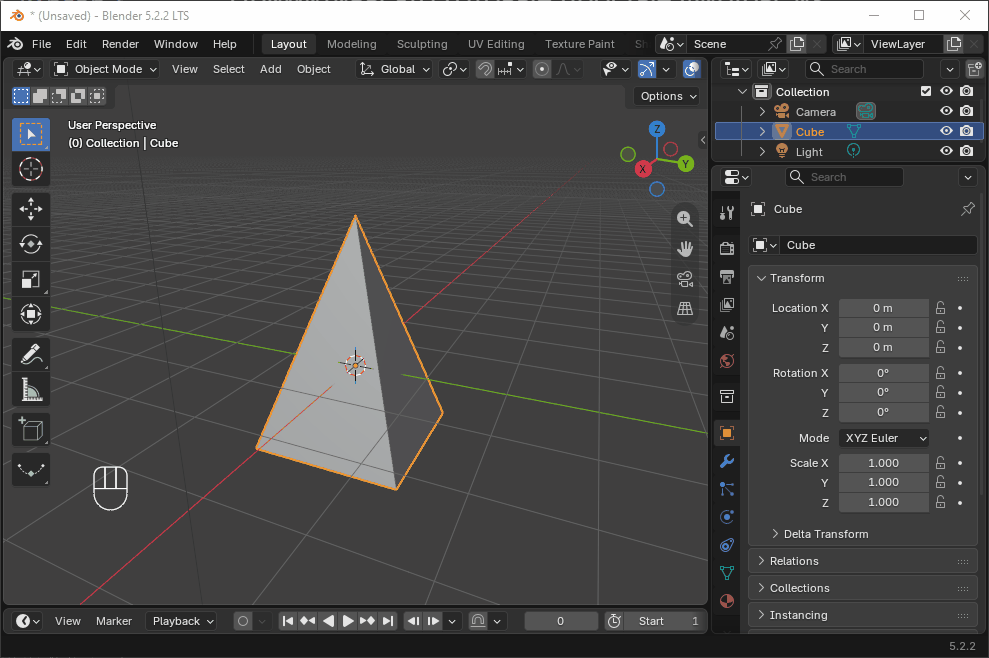

### Настройка сразу после создания

Сразу после добавления в левом нижнем углу вьюпорта появляется панель **Adjust Last Operation (Настроить последнюю операцию)**. Она может быть свёрнута в одну строчку, кликни по ней, чтобы раскрыть. Там задаются размер, количество сегментов и другие параметры фигуры.

Если панель закрылась, нажми `F9`.

> Панель работает **только до следующего действия**. Стоит подвинуть объект или кликнуть мимо, и настройки исчезнут навсегда. Сначала настрой, потом двигай.

Пример: у цилиндра параметр **Vertices (Вершины)** задаёт количество граней по кругу. При значении 6 получится шестигранная колонна, при 32 гладкий цилиндр.

<!-- 🎬 GIF-24 ЗАПИСАТЬ: добавить цилиндр, раскрыть панель слева внизу, поменять Vertices 32 → 6 → 12, поменять Radius и Depth; закрыть панель и вернуть её через F9 -->
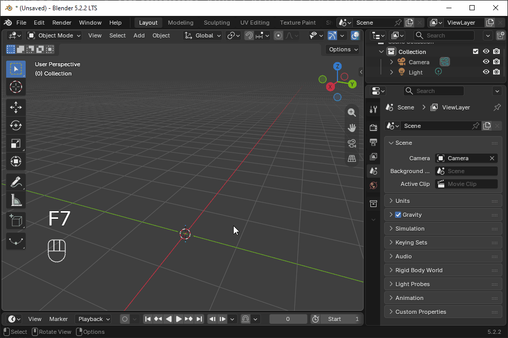

### Какие бывают примитивы

| English | Русский | Для чего в уровне |
|---|---|---|
| Plane | Плоскость | Пол, земля, вода |
| Cube | Куб | Стены, здания, ящики, ступени |
| Circle | Окружность | Основа для круглых площадок |
| UV Sphere | UV-сфера | Шары, купола, кроны деревьев |
| Ico Sphere | Икосфера | Камни, валуны |
| Cylinder | Цилиндр | Колонны, башни, трубы, бочки |
| Cone | Конус | Крыши, ёлки, шпили |
| Torus | Тор | Кольца, колёса |
| Grid | Сетка | Пол с большим числом полигонов |
| Monkey | Обезьяна (Сюзанна) | Талисман Blender, тестовый объект |

<!-- 🎬 GIF-25 ЗАПИСАТЬ: облёт по орбите вокруг всех 10 примитивов, выставленных в ряд (можно заменить статичным скриншотом с подписями) -->
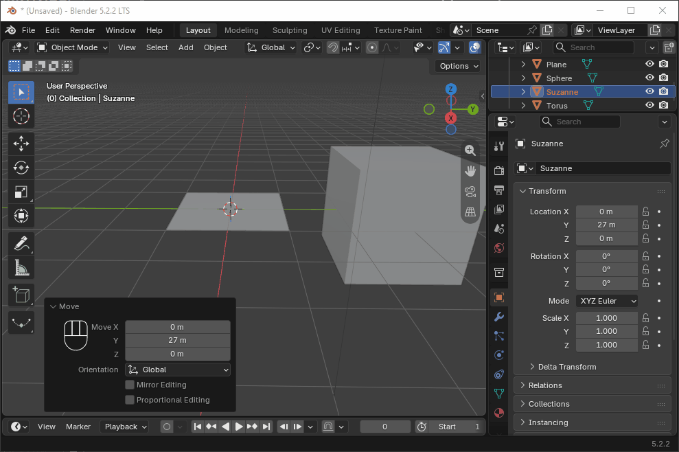

---

## 7. Задание: собери уровень из игры

В геймдеве уровень сначала собирают из простых фигур, без деталей и текстур. Это называется **Blockout (Блокаут)** или grey-box. Так проверяют размеры и расположение до того, как тратить время на красоту.

Собери узнаваемый фрагмент уровня, используя только примитивы Blender.

### Вариант 1. Готовые идеи

- **Dust II (Counter-Strike 2).** Один участок карты, например «мид» или точка B: стены и дома из кубов, ящики, арка.
- **Кафетерий на корабле из Among Us.** Круглые столы из цилиндров, кнопка экстренного собрания в центре, персонаж из цилиндра и сферы.
- **Начало уровня 1-1 из Super Mario Bros.** Земля, блоки «?», кирпичи, зелёная труба-цилиндр.
- **Арена Clash Royale.** Поле, река, два моста, башни из цилиндров с конусами-крышами.
- **Дом или деревня из Minecraft.** Всё только из кубов.

### Вариант 2. Свой пример

Возьми любую игру, которая тебе нравится, и собери её узнаваемый фрагмент.

### Что должно получиться

- [ ] Использовано не меньше 3 разных примитивов
- [ ] Фрагмент узнаваем с первого взгляда
- [ ] Файл сохранён (`Ctrl + S`)
- [ ] **Бонус:** форма хотя бы одного объекта изменена в Edit Mode

### С чего начать

1. Найди скриншот уровня и держи его перед глазами.
2. Добавь плоскость (Plane) и увеличь её: `S` `10`. Это пол.
3. Расставь самые крупные объекты: стены, здания, башни. Мелочи потом.
4. Одинаковые объекты не создавай заново, а копируй: `Shift + D`.
5. Для ровной расстановки смотри сверху (`Num 7`) и двигай по осям (`G` `X`, `G` `Y`).
6. В конце добавь детали, по которым уровень узнаётся.

---

## 8. Если что-то не работает

| Проблема | Причина и решение |
|---|---|
| Горячие клавиши не реагируют | Проверь, что раскладка английская и мышь находится над 3D-вьюпортом |
| Клавиши `Num 1` / `3` / `7` не меняют вид | Нет numpad: включи Emulate Numpad ([раздел 0](#0-перед-началом)) или пользуйся `~` и гизмо навигации |
| `1` / `2` / `3` в Edit Mode меняют вид вместо режима выделения | Включён Emulate Numpad. Переключай вершины, рёбра и грани кнопками в шапке вьюпорта |
| Объекты пропали, вокруг пустота | Нажми `Home`. Если нужен конкретный объект, выдели его в списке справа вверху (Outliner) и нажми `Num .` |
| Зум упёрся и не приближает | Выдели объект и нажми `Num .` |
| Новый объект появляется не там, где надо | Он появляется в 3D-курсоре. Переставь курсор (`Shift + ПКМ`) или верни в центр (`Shift + C`) |
| Новый примитив «склеился» со старым объектом | Ты добавил его в Edit Mode. Отмени (`Ctrl + Z`), выйди в Object Mode (`Tab`) и добавь заново |
| Исчезла панель настройки примитива | Нажми `F9`. Если после создания уже было другое действие, удали объект и создай его снова |
| Объект выглядит одним, а при перемещении их оказывается два | После `Shift + D` была нажата ПКМ, копия осталась внутри оригинала. Отодвинь или удали лишнюю |
| Нет средней кнопки мыши | Edit → Preferences → Input → Emulate 3 Button Mouse. Тогда орбита: `Alt + ЛКМ` |
| Сделал что-то не то | `Ctrl + Z`, можно несколько раз подряд |

---

## 9. Шпаргалка по клавишам

Основа урока, всё на одном экране.

| Действие | Клавиша |
|---|---|
| Выделить / добавить к выделению | `ЛКМ` / `Shift + ЛКМ` |
| Выделить всё / снять выделение | `A` / `Alt + A` |
| Дублировать | `Shift + D` |
| Удалить | `X` или `Delete` |
| Отменить | `Ctrl + Z` |
| Сохранить | `Ctrl + S` |
| Переместить / повернуть / масштабировать | `G` / `R` / `S` |
| Ограничить осью | `X` / `Y` / `Z` после `G`, `R`, `S` |
| Точное значение | число после клавиши и оси |
| Подтвердить / отменить трансформацию | `ЛКМ`, `Enter` / `ПКМ`, `Esc` |
| Орбита / сдвиг вида / зум | `СКМ` / `Shift + СКМ` / колёсико |
| Показать выделенное / показать всё | `Num .` / `Home` |
| Вид спереди / справа / сверху | `Num 1` / `Num 3` / `Num 7` |
| Object Mode ↔ Edit Mode | `Tab` |
| Вершины / рёбра / грани | `1` / `2` / `3` в Edit Mode |
| Поставить 3D-курсор | `Shift + ПКМ` |
| 3D-курсор в центр мира | `Shift + C` |
| Добавить объект | `Shift + A` |
| Вернуть панель настройки примитива | `F9` |
