# Урок 4. Модификаторы: Mirror, Array, Bevel, Subdivision Surface

**Курс:** Разработка 3D моделей и визуальных эффектов
**Версия программы:** Blender 4.2 LTS и 5.0+. Отличия версий помечены значками **[4.2]** и **[5.0+]**

Это пошаговая подсказка к уроку. Каждый раздел устроен одинаково: коротко, зачем нужен модификатор, затем упражнение по шагам, затем таблица настроек. Проходи с открытым Blender и повторяй руками.

> **★ Звёздочка** отмечает дополнительный материал. При первом прохождении его можно пропускать.

## Содержание

0. [Перед началом](#0-перед-началом)
1. [Что такое модификатор](#1-что-такое-модификатор)
2. [Mirror: симметрия](#2-mirror-симметрия)
3. [Array: повторение](#3-array-повторение)
4. [Bevel: скруглённые края](#4-bevel-скруглённые-края)
5. [Subdivision Surface: сглаживание](#5-subdivision-surface-сглаживание)
6. [Частые связки](#6-частые-связки)
7. [Если что-то не работает](#7-если-что-то-не-работает)
8. [Шпаргалка](#8-шпаргалка)

---

## 0. Перед началом

Раскладка клавиатуры английская (EN). Из прошлых уроков понадобятся:

| Клавиша | Что делает |
|---|---|
| `Tab` | Object Mode ↔ Edit Mode |
| `Ctrl` + `R` | Loop Cut, добавить луп |
| `E` / `I` | Extrude / Inset |
| `Alt` + `Z` | Рентген, выделять насквозь |
| `Ctrl` + `A` → Scale | Применить масштаб (Object Mode) |
| `ПКМ` → Shade Auto Smooth | Сглаживание (Object Mode) |

Если что-то забыл, загляни в [лекцию урока 3](Урок-3-Низкополигональное-моделирование.md).

---

## 1. Что такое модификатор

**Modifier (Модификатор)** это автоматическая операция над моделью, которая не портит исходную сетку. Его можно отключить, перенастроить или удалить в любой момент. Пока модификатор не **применён** (Apply), ты редактируешь «чистую» простую модель, а результат Blender пересчитывает сам.

Сравни: инструмент `Ctrl + B` из прошлого урока делает фаску один раз и навсегда. Модификатор Bevel делает ту же фаску, но её ширину можно поменять хоть через неделю.

### Где они находятся

В редакторе **Properties (Свойства)** справа внизу есть вкладка с гаечным ключом, это **Modifier Properties (Свойства модификаторов)**. Все модификаторы выделенного объекта лежат там списком. Этот список называют **стеком**.

<!-- 🖼 PNG-01 СНЯТЬ: скриншот вкладки Modifier Properties с одним добавленным модификатором. Подписать стрелками: вкладка с ключом, кнопка Add Modifier, три иконки в шапке (Edit Mode / Realtime / Render), стрелка ▾ с меню, ручка из точек справа -->
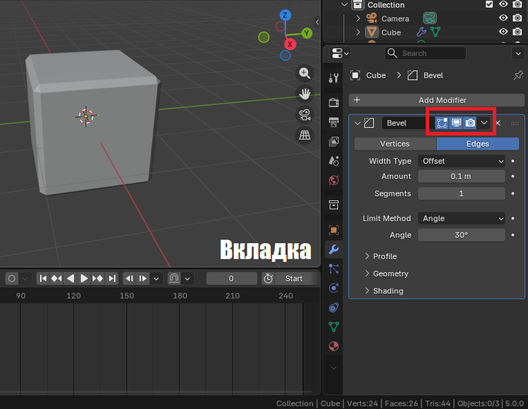

### Упражнение: добавить, выключить, применить

1. Выдели куб в Object Mode.
2. Открой вкладку с гаечным ключом.
3. Нажми **Add Modifier (Добавить модификатор)** → **Generate (Генерация)** → **Bevel**. Все четыре модификатора этого урока лежат в группе Generate.
4. У куба появились скошенные края. Нажми `Tab`: в Edit Mode у куба по-прежнему 8 вершин. Исходная сетка не изменилась.
5. Вернись в Object Mode. В шапке модификатора нажми иконку с монитором (**Realtime**): фаска пропала. Нажми ещё раз: вернулась.
6. Наведи мышь на панель модификатора и нажми `Ctrl + A`. Модификатор исчез из списка, а фаска стала настоящей геометрией. Проверь через `Tab`: вершин стало больше.

<!-- 🎬 GIF-02 ЗАПИСАТЬ: шаги 3–6: Add Modifier → Generate → Bevel; Tab туда-обратно (сетка прежняя); клик по иконке Realtime выкл/вкл; Ctrl+A над панелью; Tab — геометрия стала настоящей -->
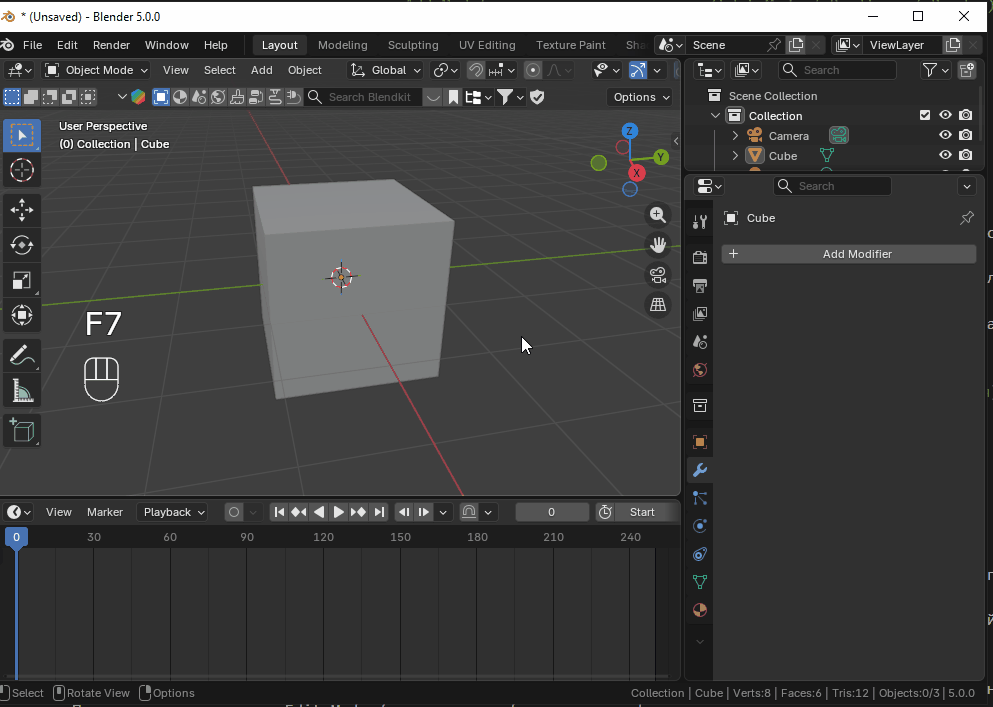

| Где / клавиша | English | Русский | Что делает |
|---|---|---|---|
| Properties → вкладка с гаечным ключом | Modifier Properties | Свойства модификаторов | Здесь весь стек модификаторов объекта |
| Add Modifier → Generate | Add Modifier | Добавить модификатор | Все 4 модификатора урока лежат в группе Generate |
| `Ctrl` + `A` над панелью модификатора | Apply | Применить | Сделать результат настоящей геометрией. Модификатор исчезнет |
| `X` / `Delete` над панелью | Delete | Удалить | Убрать модификатор, модель вернётся к исходной |
| Иконки в шапке модификатора | Edit Mode / Realtime / Render | Режим редактирования / Вьюпорт / Рендер | Показывать результат в Edit Mode / во вьюпорте / при рендере |
| ★ `Shift` + `D` над панелью | Duplicate | Дублировать | Копия модификатора с теми же настройками |
| ★ Стрелка ▾ → Copy to Selected | Copy to Selected | Копировать на выделенные | Перенести модификатор на другие выделенные объекты |

Apply работает только в Object Mode. И не спеши применять: применённый модификатор уже не перенастроить. Обычно это делают в самом конце, перед экспортом модели.

### Порядок важен

Стек считается **сверху вниз**: каждый модификатор получает то, что выдал предыдущий. Поменяешь порядок, изменится результат.

Удобный порядок на все случаи:

> **Mirror → Array → Bevel → Subdivision Surface**

Перетаскивать модификаторы можно за ручку из точек справа в шапке.

<!-- 🎬 GIF-03 ЗАПИСАТЬ: куб с Bevel и Subdivision Surface. Порядок Bevel → Subdivision: скруглённая коробка с чёткими краями. Перетащить Subdivision наверх за ручку: получается шар-капля. Вернуть обратно -->
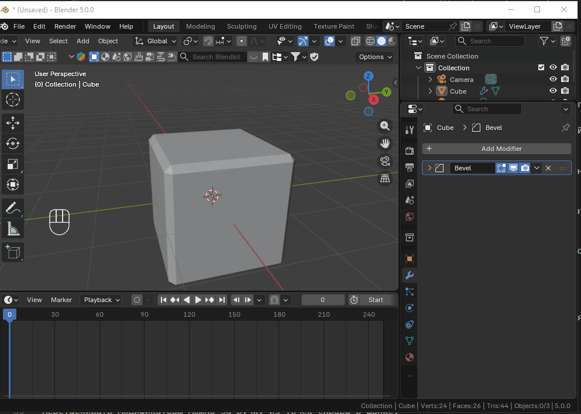

### Сначала примени масштаб

Перед тем как добавлять модификаторы, в Object Mode нажми `Ctrl + A` → **Scale**. Иначе фаски и отступы будут неровными: с одной стороны шире, с другой уже.

---

## 2. Mirror: симметрия

**Mirror (Зеркало)** отражает модель относительно **точки начала объекта (Origin)**, это оранжевая точка в его центре. Ты моделируешь половину, вторая появляется сама. Подходит для всего симметричного: персонажи, машины, оружие, мебель.

### Упражнение: половина куба

1. Новый куб. `Tab` в Edit Mode.
2. `Ctrl + R`, наведи на ребро так, чтобы жёлтая линия разрезала куб на левую и правую половину. `ЛКМ`, затем `ПКМ`: луп встал ровно по центру.
3. Включи рентген `Alt + Z` и посмотри спереди: `Num 1`.
4. Нажми `1` (вершины) и выдели рамкой все вершины **левой** половины. Центральный луп не трогай.
5. `X` → **Vertices**. Осталась половина куба с открытой стороной.
6. Выключи рентген (`Alt + Z`).
7. Add Modifier → Generate → **Mirror**. Куб снова целый.
8. В настройках модификатора включи галочку **Clipping**.

<!-- 🎬 GIF-04 ЗАПИСАТЬ: шаги 1–8 целиком: Ctrl+R по центру с ПКМ, Alt+Z, Num 1, рамка по левым вершинам, X → Vertices, Add Modifier → Mirror, включить Clipping -->
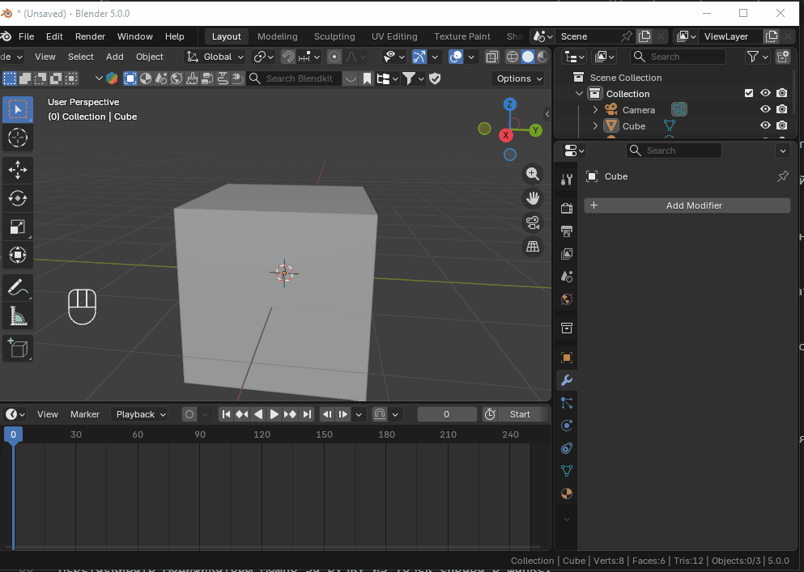

Теперь проверь, что зеркало работает:

9. Нажми `3`, выдели любую грань на правой стороне и сделай `E`. То же самое выросло слева.
10. Выдели верхнюю грань и сделай `I`, затем `E` вверх. Обрати внимание на центр: благодаря Clipping вершины на шве не расходятся и половины остаются склеенными.

**Clipping (Обрезка)** не даёт вершинам заходить за плоскость зеркала. Те, что дошли до неё, «прилипают» и дальше двигаются только вдоль плоскости. Без этой галочки по центру модели легко получить щель или нахлёст.

<!-- 🎬 GIF-05 ЗАПИСАТЬ: сначала с выключенным Clipping потянуть центральные вершины по X — щель, затем нахлёст; Ctrl+Z; включить Clipping, повторить — вершины упираются в центр. Затем шаги 9–10: E сбоку, I + E сверху -->
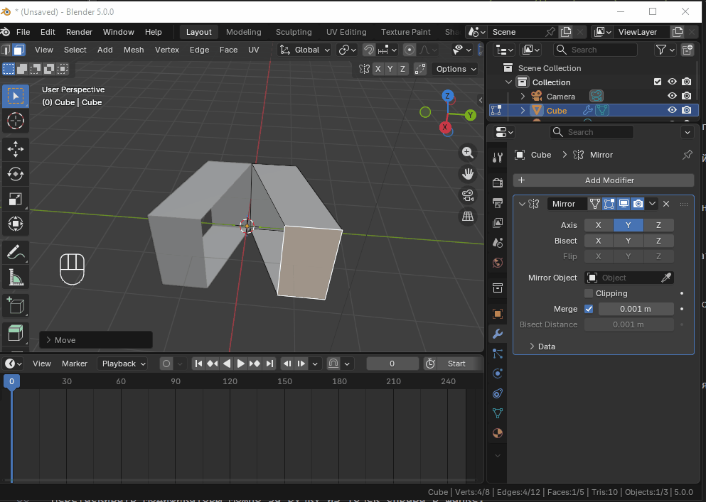

### Настройки

| Поле | English | Русский | Что делает |
|---|---|---|---|
| X / Y / Z | Axis | Ось | По какой оси отражать (обычно X) |
| Галочка | Clipping | Обрезка | Вершины не заходят за плоскость зеркала и «прилипают» к ней |
| Галочка + число | Merge | Объединить | Склеивает вершины на шве (по умолчанию включено) |
| ★ X / Y / Z | Bisect | Рассечь | Срезает часть модели, заходящую за плоскость зеркала |
| ★ X / Y / Z | Flip | Перевернуть | Отражать в другую сторону |
| ★ Поле объекта | Mirror Object | Объект отражения | Отражать относительно другого объекта (например, Empty) |

> Зеркало проходит через Origin, а не через середину модели. Если подвинуть объект в Object Mode, Origin едет вместе с ним и всё в порядке. Если подвинуть всю геометрию в Edit Mode, она уедет от Origin, и между половинами появится разрыв.

---

## 3. Array: повторение

**Array (Массив)** создаёт ряд копий: заборы, лестницы, цепи, колонны, рельсы, болты по кругу. Моделируешь одну деталь, остальные получаешь бесплатно. Поправил одну доску, изменились все.

В Blender 5.0 появился новый Array, а старый остался под именем **Array (Legacy)**. Найди свою версию ниже.

### Упражнение: забор, классический массив

**[4.2]** Add Modifier → Generate → **Array**
**[5.0+]** Add Modifier → Generate → **Array (Legacy)**

1. Новый куб. В Edit Mode сделай из него доску: `S` `X` `0.1`, затем `S` `Y` `0.03`. Вернись в Object Mode.
2. Добавь модификатор Array. Рядом появилась вторая доска вплотную к первой.
3. Поставь **Count** = `10`.
4. В **Relative Offset** поменяй X с `1` на `1.5`. Между досками появился зазор в полдоски.
5. Зайди в Edit Mode и сузь верхнюю грань доски (`S`). Заострились все десять.

<!-- 🎬 GIF-06 ЗАПИСАТЬ: шаги 1–5: доска, Add Modifier → Array, Count 2 → 10, Relative Offset X 1 → 1.5, затем в Edit Mode сузить верх — меняются все копии -->
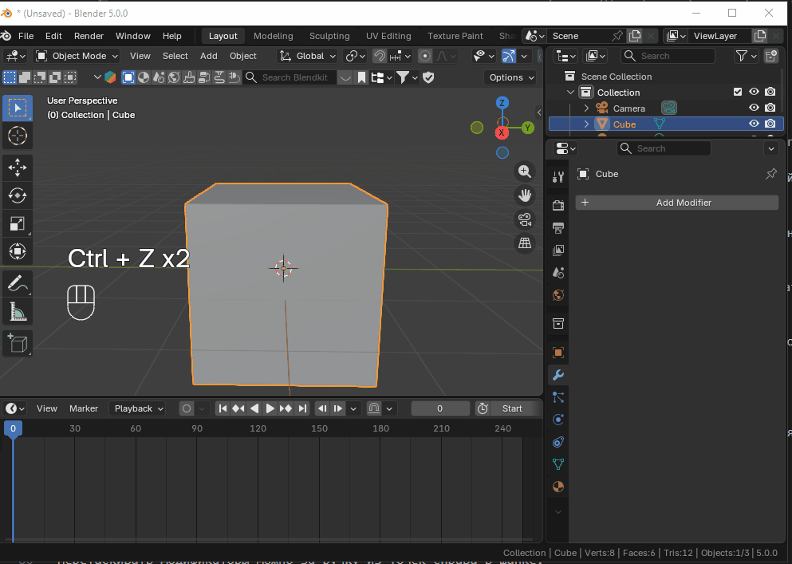

**Попробуй сам, лестница.** Сделай ступеньку (широкий плоский куб). В Relative Offset поставь X = `0`, Y = `1`, Z = `1`. Каждая копия сдвигается на одну ступеньку вглубь и на одну вверх.

| Поле | English | Русский | Что делает |
|---|---|---|---|
| Fit Type → Fixed Count | Fixed Count | Фиксированное количество | Задать число копий вручную |
| Count | Count | Количество | Сколько всего копий |
| Relative Offset | Relative Offset | Относительное смещение | Шаг в «размерах объекта»: 1 вплотную, 1,5 с промежутком |
| Constant Offset | Constant Offset | Постоянное смещение | Шаг в метрах |
| Merge | Merge | Объединить | Склеить соседние копии в одну сетку |
| ★ Object Offset | Object Offset | Смещение по объекту | Шаг задаёт объект-помощник (Empty). Так делают круговой массив |
| ★ Fit Length / Fit Curve | Fit Length / Fit Curve | По длине / По кривой | Столько копий, сколько поместится в длину или вдоль кривой |

### ★ Круговой массив в классическом Array

Копии по кругу: болты на колесе, колонны ротонды, зубцы шестерёнки. Шаг между копиями задаёт пустой объект-помощник **Empty**.

1. Создай деталь в центре мира. В **Edit Mode** отодвинь её геометрию от центра: `A`, затем `G` `X` `2`. Origin остался в центре, это и будет центр круга.
2. Вернись в Object Mode. `Shift + A` → Empty → **Plain Axes**. Он тоже появится в центре.
3. Выдели деталь, добавь Array. Выключи **Relative Offset**, включи **Object Offset** и выбери в поле свой Empty.
4. Поставь Count = `8`.
5. Выдели Empty и поверни: `R` `Z` `45` `Enter`. Копии встали по кругу.

Угол считается так: 360° / Count. Для 8 копий это 45°, для 6 копий 60°, для 12 копий 30°.

<!-- 🎬 GIF-07 ЗАПИСАТЬ ★: шаги 1–5: сместить геометрию в Edit Mode, добавить Empty, Array с Object Offset, Count 8, R Z 45 на Empty -->
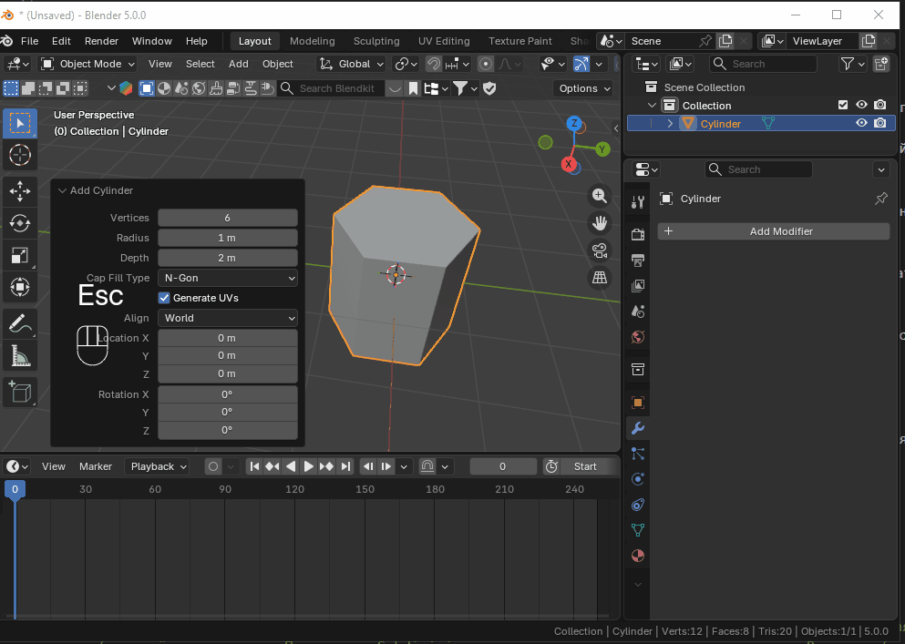

### [5.0+] Новый Array

Новый массив построен на Geometry Nodes. Он умеет линию, круг и кривую без объектов-помощников, показывает гизмо во вьюпорте и умеет случайный разброс.

1. Выдели деталь. Add Modifier → Generate → **Array**.
2. **Shape** = **Line**. Задай Count и шаг. Шаг можно тянуть прямо во вьюпорте за гизмо.
3. Переключи Shape на **Circle**. Настрой **Radius** и **Central Axis**. Empty не нужен.
4. Включи **Align Rotation**, чтобы копии поворачивались по направлению круга.

<!-- 🎬 GIF-08 ЗАПИСАТЬ [5.0+]: Add Modifier → Array, Shape Line, Count, потянуть гизмо во вьюпорте; переключить на Circle, покрутить Radius и Count, включить Align Rotation -->
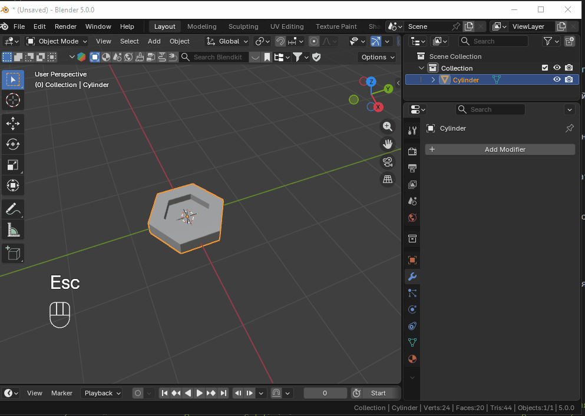

| Поле | English | Русский | Что делает |
|---|---|---|---|
| Shape | Line / Circle / Curve / Transform | Линия / Круг / Кривая / Трансформация | Как раскладывать копии |
| Count | Count | Количество | Сколько копий |
| Offset Method (Line) | Relative / Offset | Относительный / Смещение | Шаг в размерах объекта или в метрах |
| Radius, Central Axis (Circle) | Radius / Central Axis | Радиус / Центральная ось | Размер круга и ось, вокруг которой он строится |
| Realize Instances | Realize Instances | Реализовать экземпляры | Превратить копии в настоящую геометрию (нужно для Merge) |
| ★ Align Rotation | Align Rotation | Выровнять вращение | Поворачивать копии по направлению круга / кривой |
| ★ Randomize | Randomize | Случайный разброс | Добавить вариации положения, поворота и масштаба |

---

## 4. Bevel: скруглённые края

В реальности идеально острых углов почти нет. **Bevel (Фаска)** срезает край, и на срезе появляется блик. Модель сразу выглядит аккуратнее и «дороже».

### Упражнение: ящик

1. Новый куб. Если менял размер в Object Mode, примени масштаб: `Ctrl + A` → Scale.
2. Add Modifier → Generate → **Bevel**.
3. Поставь **Amount** = `0.05`. Это ширина фаски.
4. **Segments** = `1`: плоский скос, вариант для low-poly. Поставь `3`: край стал скруглённым.
5. В Object Mode: `ПКМ` → **Shade Auto Smooth**. Скругление стало гладким, а плоские стороны остались плоскими.

<!-- 🎬 GIF-09 ЗАПИСАТЬ: куб, Add Modifier → Bevel, Amount 0.02 → 0.05 → 0.15, Segments 1 → 3 → 5, затем ПКМ → Shade Auto Smooth. Вид с бликом на крае -->
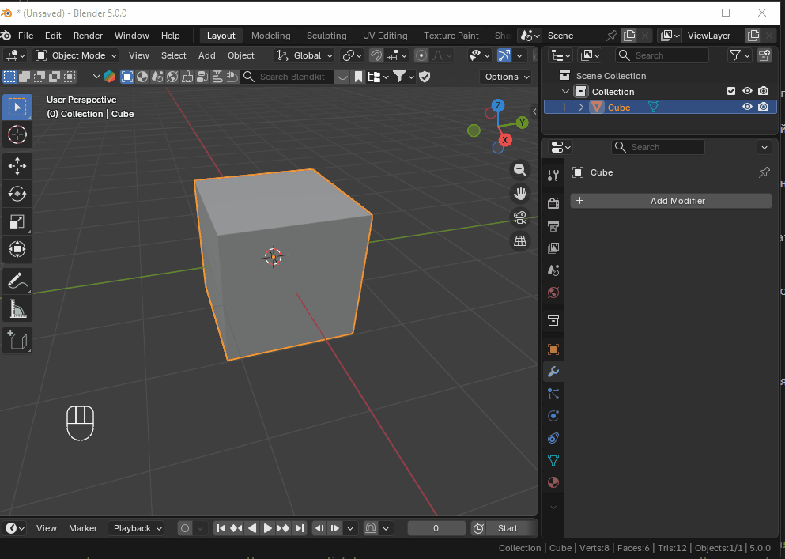

### Какие рёбра скашивать

Попробуй добавить Bevel на цилиндр. Скошены только верхний и нижний край, а вертикальные рёбра по бокам нет. За это отвечает **Limit Method** = **Angle**: фаска появляется только на рёбрах, где грани сходятся под углом острее заданного. По умолчанию это 30°.

- Уменьшаешь угол: фаска захватывает и пологие рёбра.
- Увеличиваешь: остаются только самые острые.

<!-- 🎬 GIF-10 ЗАПИСАТЬ: цилиндр на 12 вершин с Bevel; Limit Method Angle 30° — скошены только края; уменьшить угол до 10° — скосились и боковые рёбра; вернуть 30° -->
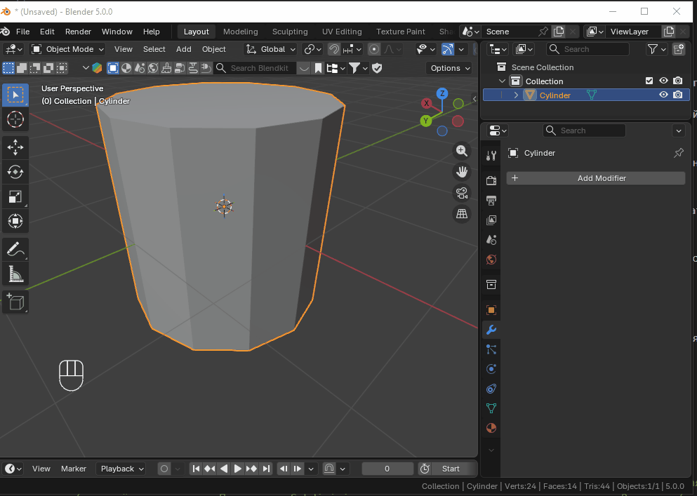

### Настройки

| Поле | English | Русский | Что делает |
|---|---|---|---|
| Edges / Vertices | Affect | Применить к | Скашивать рёбра или вершины (обычно Edges) |
| Amount | Amount | Величина | Ширина фаски |
| Segments | Segments | Сегменты | 1 даёт плоский скос (low-poly), 3 и больше дают скругление |
| Limit Method → Angle | Limit Method | Метод ограничения | Фаска только на рёбрах острее заданного угла (30° по умолчанию) |
| ★ Limit Method → Weight | Weight | Вес | Фаска только на рёбрах с весом фаски (Edge → Edge Bevel Weight) |
| ★ Галочка | Clamp Overlap | Ограничить перекрытие | Не даёт фаскам налезать друг на друга |
| ★ Shading → Harden Normals | Harden Normals | Жёсткие нормали | Чистое затенение плоских граней рядом с фаской |

★ **Harden Normals.** При сглаживании на плоских сторонах рядом с фаской иногда видны градиенты, будто грань слегка выпуклая. Галочка Harden Normals это убирает. Она работает только при включённом Shade Smooth или Shade Auto Smooth.

<!-- 🖼 PNG-11 СНЯТЬ ★: два одинаковых куба с Bevel и Shade Smooth рядом: слева Harden Normals выключен (градиент на гранях), справа включён (грани чистые). Подписать -->
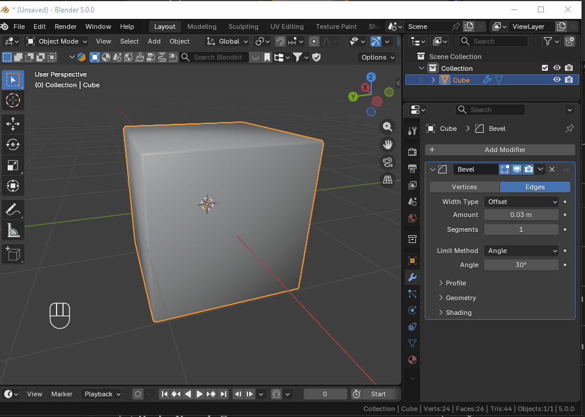

---

## 5. Subdivision Surface: сглаживание

**Subdivision Surface (Поверхность подразделения)** делит каждый полигон на 4 и сглаживает модель. Из грубой «коробки» получается гладкая форма. Так делают персонажей, технику, пластиковые предметы.

### Упражнение: из куба в гладкую форму

1. Новый куб, Object Mode.
2. Нажми `Ctrl + 1`. Blender сам добавил модификатор с уровнем 1. Куб стал угловатым шаром.
3. `Ctrl + 2`: уровень 2, шар глаже.
4. `ПКМ` → **Shade Smooth**.
5. Зайди в Edit Mode. Вокруг гладкой формы видна «клетка» исходного куба, у которого всё те же 8 вершин. Подвигай их: гладкая форма тянется следом.

<!-- 🎬 GIF-12 ЗАПИСАТЬ: куб, Ctrl+1, Ctrl+2, ПКМ → Shade Smooth, Tab — видна клетка куба, подвигать вершину и грань; в кадре Statistics, чтобы было видно рост числа треугольников по уровням -->
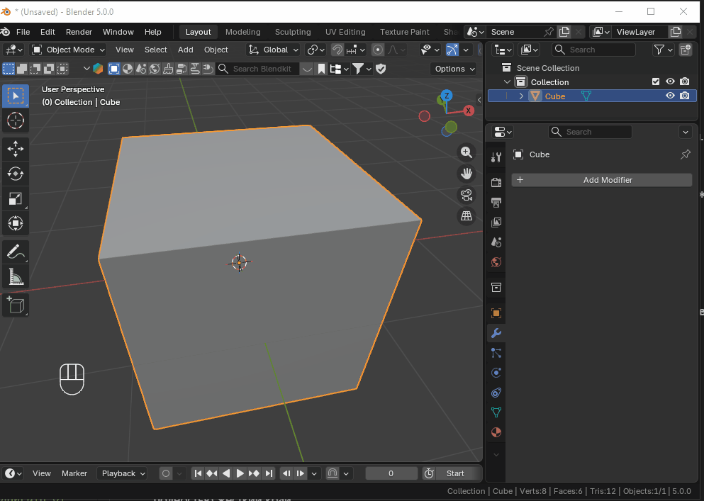

### Как сохранить острые углы

Сейчас куб превратился в шар. Чтобы получить коробку со скруглёнными краями, нужны **опорные лупы**:

1. В Edit Mode нажми `Ctrl + R` и добавь луп рядом с краем куба. Сдвинь его ближе к ребру.
2. Смотри на гладкую форму: чем ближе луп к краю, тем острее угол.
3. Повтори у противоположного края и по другим направлениям.

<!-- 🎬 GIF-13 ЗАПИСАТЬ: куб с Subdivision уровня 2; Ctrl+R, луп медленно сдвигать от центра к краю — угол становится острее; добавить лупы у остальных краёв, получается коробка со скруглениями -->
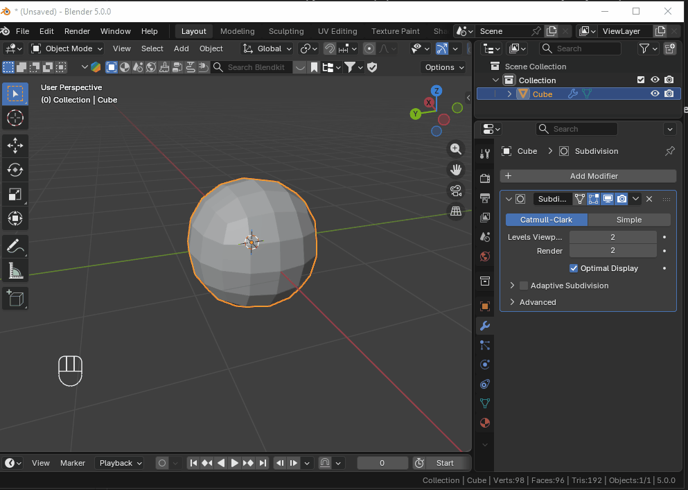

★ **Edge Crease (Складка ребра).** То же самое без новых лупов: выдели ребро в Edit Mode, нажми `Shift + E` и двигай мышь. Ребро подсвечивается розовым и становится острым. Значение 1 даёт полностью жёсткий край.

<!-- 🎬 GIF-14 ЗАПИСАТЬ ★: куб с Subdivision, выделить верхние четыре ребра, Shift+E, потянуть до 1 — верх стал острым, низ остался круглым -->
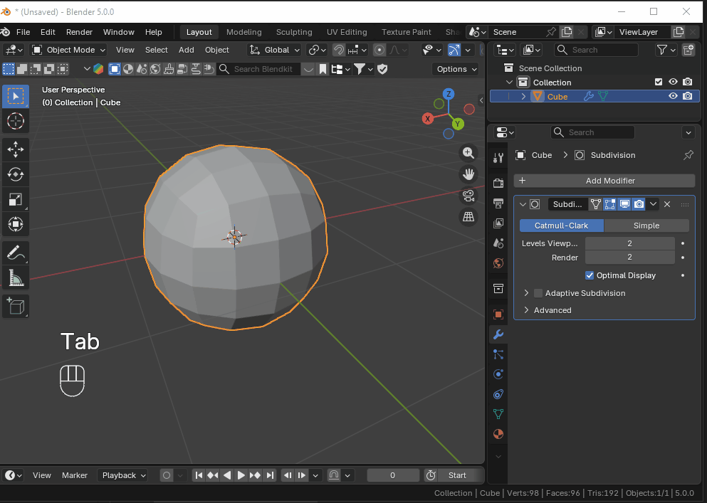

### Работай четырёхугольниками

Subdivision Surface хорошо сглаживает только сетку из четырёхугольников (quads). Треугольники и многоугольники (n-гоны) дают вмятины и складки. Если на гладкой модели появилось странное пятно, ищи рядом грань не с четырьмя углами.

<!-- 🖼 PNG-15 СНЯТЬ: две модели с Subdivision и Shade Smooth рядом, показана исходная сетка: слева только quads (гладко), справа с треугольником или n-гоном (вмятина). Подписать -->

### Осторожно с полигонами

Каждый уровень умножает число полигонов примерно в 4 раза:

| Уровень | Граней у куба |
|---|---|
| 0 | 6 |
| 1 | 24 |
| 2 | 96 |
| 3 | 384 |
| 4 | 1 536 |

Во вьюпорте достаточно уровня 1–2, для рендера 2–3. Для low-poly моделей в игру Subdivision Surface обычно не используют или применяют с уровнем 1.

### Настройки

| Поле / клавиша | English | Русский | Что делает |
|---|---|---|---|
| `Ctrl` + `1` / `2` / `3` | Subdivision Set | Задать подразделение | Быстро добавить модификатор с нужным уровнем |
| Catmull-Clark / Simple | Catmull-Clark / Simple | Кэтмелл-Кларк / Простой | Сглаживать или только делить без сглаживания |
| Levels Viewport | Levels Viewport | Уровни во вьюпорте | Уровень во вьюпорте: 1–2 достаточно |
| Render | Render | Рендер | Уровень при рендере: 2–3 |
| ★ Optimal Display | Optimal Display | Оптимальное отображение | Показывать во вьюпорте только исходные рёбра |
| ★ `Shift` + `E` (Edit Mode) | Edge Crease | Складка ребра | Сделать выделенное ребро острым без лишних лупов |
| ★ [5.0+] Adaptive Subdivision | Adaptive Subdivision | Адаптивное подразделение | В Cycles больше не экспериментальная функция: детализация зависит от расстояния до камеры |

---

## 6. Частые связки

Модификаторы редко используют по одному. Три сочетания встречаются постоянно.

### Mirror + Subdivision Surface

Персонажи и техника. Моделируешь половину грубой формы, получаешь гладкую симметричную модель.

Попробуй по шагам:

1. Подготовь половину куба с Mirror и Clipping, как в [разделе 2](#2-mirror-симметрия).
2. `Ctrl + 2`, затем `ПКМ` → Shade Smooth.
3. Проверь стек: Mirror должен стоять **выше** Subdivision Surface. Если наоборот, по центру модели будет шов.
4. В Edit Mode вытягивай форму через `E`, `G`, `S`. Из нескольких выдавливаний получается голова зверя, машинка или космический корабль.

<!-- 🎬 GIF-16 ЗАПИСАТЬ: ускоренная запись, 15–20 секунд: половина куба с Mirror → Ctrl+2 → несколько E и S, получается простая симметричная фигура (голова зверя с ушами или машинка). В кадре стек модификаторов -->
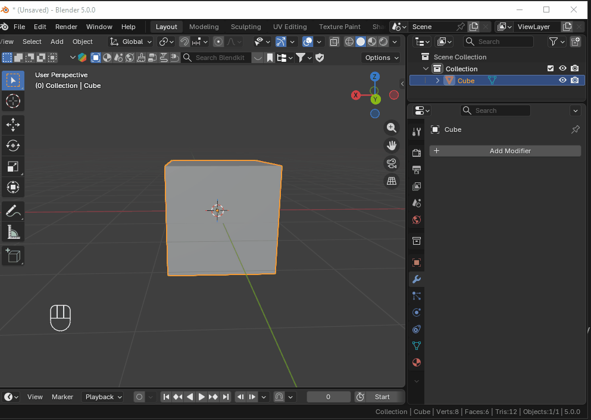

### Array + Bevel

Заборы, лестницы, решётки. Одна деталь с фаской превращается в ряд.

1. Возьми забор из [раздела 3](#3-array-повторение).
2. Добавь Bevel: Amount около `0.01`, Segments `1`.
3. Проверь стек: Array выше, Bevel ниже.

<!-- 🎬 GIF-17 ЗАПИСАТЬ: забор из раздела 3, добавить Bevel, настроить Amount; затем в Edit Mode изменить форму доски — меняется весь ряд вместе с фасками. В кадре стек модификаторов -->
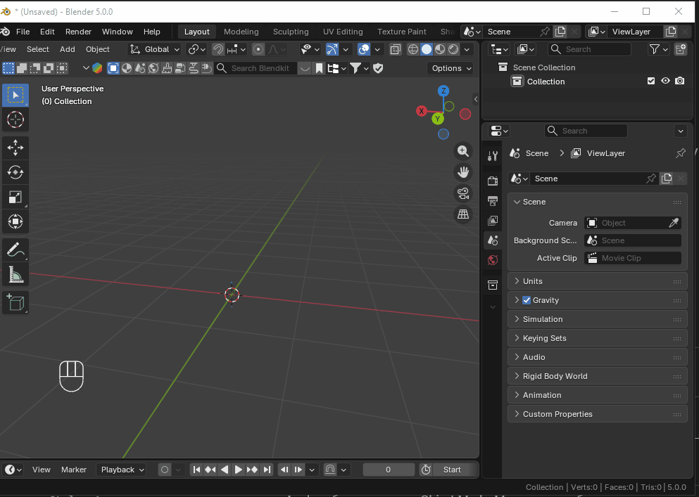

### Bevel без Subdivision Surface

Low-poly пропсы для игр. Bevel с Segments 1–2 даёт аккуратные края и почти не добавляет полигонов. Бочке или ящику из урока 3 этого достаточно.

### Попробуй сам

Выбери одно и собери с модификаторами:

- **Стол или скамейка:** Mirror по двум осям (X и Y), моделируешь одну ножку и четверть столешницы.
- **Лестница с перилами:** Array для ступеней, второй объект с Array для стоек перил.
- **Колесо:** круговой Array для спиц или болтов.
- **Игрушечная машинка:** Mirror + Subdivision Surface.

---

## 7. Если что-то не работает

| Проблема | Причина и решение |
|---|---|
| Нет кнопки Add Modifier | Не выделен объект или открыта не та вкладка. Нужна вкладка с гаечным ключом |
| `Ctrl + A` над панелью не применяет модификатор | Apply работает только в Object Mode. Мышь должна быть над панелью модификатора, а не над вьюпортом |
| Фаска неровная: с одной стороны шире | Не применён масштаб. Object Mode, `Ctrl + A` → Scale |
| Mirror: между половинами щель | Геометрия отодвинута от Origin, или центральные вершины сдвинуты от центра. Верни вершины шва на X = 0 и включи Clipping |
| Mirror: половины накладываются друг на друга | Не удалена вторая половина модели. Удали её или включи ★ Bisect |
| Mirror отражает не в ту сторону | Выбрана не та ось. Попробуй Y или Z вместо X, либо ★ Flip |
| Вершины по центру «приклеились» и не отодвигаются | Это работает Clipping. Выключи галочку на время, подвинь, включи обратно |
| Array: копии слишком далеко или слишком близко | Не применён масштаб, либо перепутаны Relative Offset (в размерах объекта) и Constant Offset (в метрах) |
| Круговой Array: копии идут спиралью или меняют размер | У детали или у Empty не применён масштаб либо поворот, или они стоят в разных точках. Origin детали и Empty должны совпадать |
| [5.0+] Не нахожу привычный Array | Он называется Array (Legacy) |
| Bevel ничего не делает | Amount слишком маленький, либо все углы модели тупее, чем Angle в Limit Method. Уменьши угол |
| Bevel: фаски налезают друг на друга | Amount слишком большой. Уменьши его или включи ★ Clamp Overlap |
| Subdivision превратил модель в бесформенную каплю | Не хватает опорных лупов у краёв. Добавь `Ctrl + R` ближе к углам |
| Subdivision: вмятины и складки на поверхности | Рядом треугольник или n-гон. Перестрой в четырёхугольники |
| Subdivision: модель гранёная | `ПКМ` → Shade Smooth |
| Blender тормозит | Слишком высокий уровень Subdivision. Поставь Levels Viewport 1–2 |
| Результат странный, хотя каждый модификатор настроен верно | Проверь порядок: Mirror → Array → Bevel → Subdivision Surface |

---

## 8. Шпаргалка

| Действие | Как |
|---|---|
| Открыть модификаторы | Properties → вкладка с гаечным ключом |
| Добавить | Add Modifier → Generate |
| Применить | `Ctrl + A` над панелью (Object Mode) |
| Удалить | `X` над панелью |
| Показать / скрыть результат | Иконка монитора в шапке модификатора |
| Поменять порядок | Тянуть за ручку из точек справа |
| Порядок по умолчанию | Mirror → Array → Bevel → Subdivision Surface |
| Перед модификаторами | `Ctrl + A` → Scale |
| Subdivision быстро | `Ctrl + 1` / `2` / `3` |

| Модификатор | Зачем | Главные настройки |
|---|---|---|
| Mirror | Симметрия | Axis, Clipping |
| Array | Ряд копий | Count, Relative Offset |
| Bevel | Скошенные края | Amount, Segments, Limit Method |
| Subdivision Surface | Сглаживание | Levels Viewport, опорные лупы |
