# Урок-закрепление: референс и свет

В этом уроке повторяем три вещи, которые понадобятся для задания:

1. как добавить картинку-референс на сцену;
2. как поставить, настроить и увидеть источники света;
3. как плавно менять форму модели с помощью пропорционального редактирования.

В конце — задание: набор построек для игры в жанре MOBA / Tower Defense и их рендер.

---

## 1. Референс на сцене

Референс — это картинка-образец, которая висит прямо в сцене. По ней удобно сверять пропорции и силуэт, не переключаясь между окнами.

### Как добавить

1. Перейди на нужный вид: спереди `Numpad 1` или сбоку `Numpad 3`. Картинка встанет «лицом» к тому виду, с которого ты смотришь.
2. Нажми `Shift + A` → **Image** → **Reference**.
3. Выбери файл с картинкой и нажми **Load Reference Image**.

<!-- GIF 1: добавление референса через Shift+A → Image → Reference -->

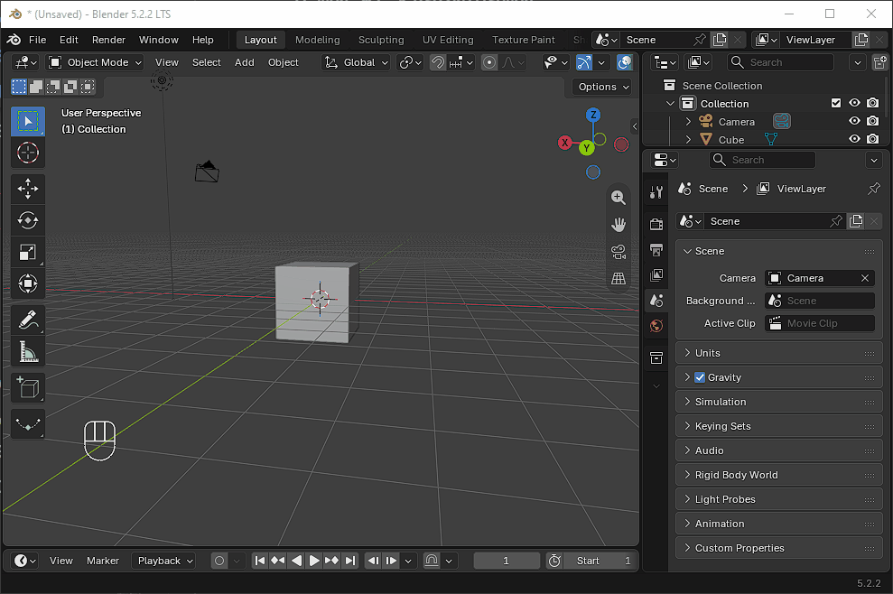
> **Быстрый способ:** картинку можно просто перетащить из папки в окно вьюпорта.

### Как разместить

Референс — обычный объект, он двигается теми же клавишами:

| Действие | Клавиша |
|---|---|
| Переместить | `G` |
| Повернуть | `R` |
| Масштабировать | `S` |

Отодвинь картинку за модель (например, `G` → `Y`), чтобы она не перекрывала постройку.

<!-- GIF 2: перемещение и масштабирование референса, отодвигание за модель -->
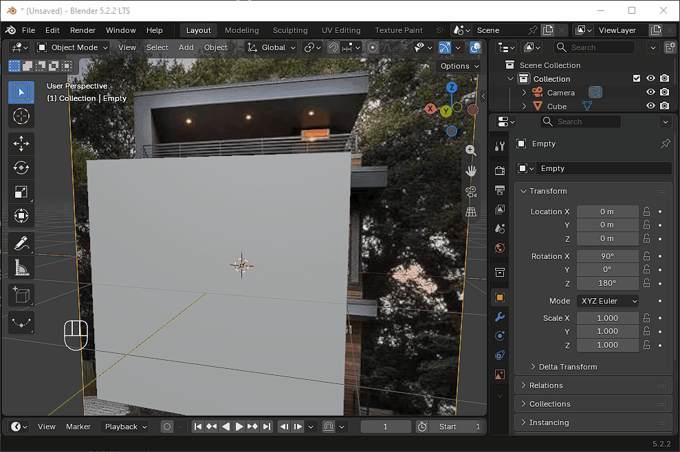

### Как настроить

Выдели референс и открой вкладку **Object Data Properties** (значок картинки в панели свойств справа).

- **Opacity** — прозрачность. Поставь галочку и уменьши значение до 0.3–0.5, чтобы модель было видно сквозь картинку.
- **Depth** → **Back** — картинка всегда рисуется позади объектов.
- **Side** — с какой стороны картинка видна: спереди, сзади или с обеих.
- **Show In** → **Perspective** — сними галочку, если хочешь видеть референс только в ортогональных видах.

<!-- GIF 3: настройка Opacity и Depth у референса -->
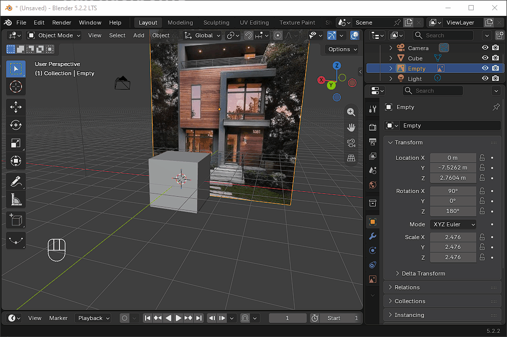
### Как не сдвинуть случайно

В окне **Outliner** открой фильтр (значок воронки) и включи значок стрелки — **Selectable**. Затем отключи стрелку напротив референса: теперь его нельзя выделить кликом во вьюпорте.

<!-- GIF 4: блокировка выделения референса в Outliner -->

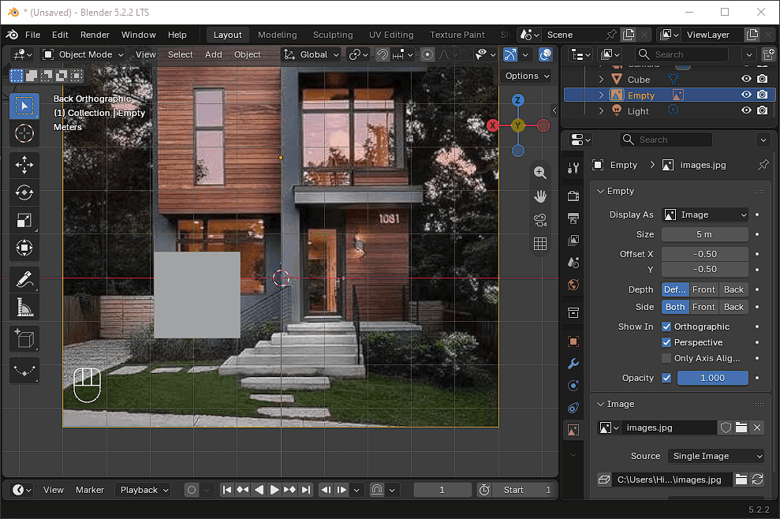
> Референс не попадает на итоговый рендер — удалять его перед рендером не нужно.

---

## 2. Источники света

### Как добавить

`Shift + A` → **Light** → выбери тип.

| Тип | Как светит | Для чего подходит |
|---|---|---|
| **Point** | Во все стороны из одной точки | Факел, лампа, магический кристалл |
| **Sun** | Параллельными лучами по всей сцене | Основной дневной свет |
| **Spot** | Конусом, как прожектор | Акцент на одной постройке |
| **Area** | Мягко, от плоскости | Ровная заливка, мягкие тени |

<!-- GIF 5: добавление источника света через Shift+A → Light -->

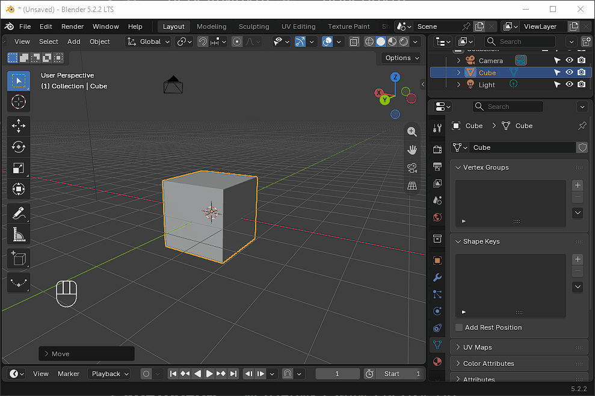
### Как разместить

- `G` — передвинуть, `R` — повернуть.
- Для **Sun** важен только поворот: положение в сцене на освещение не влияет.
- Для **Point**, **Spot** и **Area** важно и положение, и расстояние до объекта: чем ближе, тем ярче.
- У **Spot** и **Area** можно потянуть за жёлтую точку на конце линии — так быстро наводится направление света.

Рабочая схема для рендера построек:

1. **Основной свет** — Sun или Area сверху-сбоку, под углом примерно 45°.
2. **Заполняющий** — слабый Area с противоположной стороны, чтобы тени не были чёрными.
3. **Контровой** — источник сзади-сверху, он подсвечивает контур модели.

<!-- GIF 6: размещение и поворот источников, схема из трёх источников -->

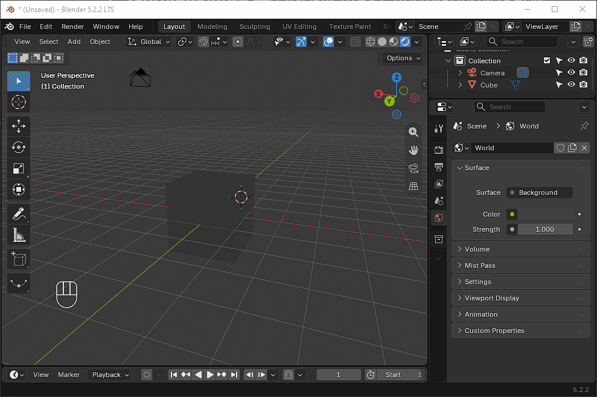
### Как настроить

Выдели источник и открой вкладку **Object Data Properties** (значок лампочки).

- **Color** — цвет света. Тёплый основной и холодный заполняющий дают приятный контраст.
- **Power** — мощность в ваттах (у Point, Spot, Area). У **Sun** вместо неё **Strength**: начни со значений 2–5.
- **Radius** — размер источника: чем больше, тем мягче края теней.
- **Spot Size** и **Blend** (только Spot) — ширина конуса и мягкость его края.
- **Shape** и **Size** (только Area) — форма и размер светящейся плоскости.

<!-- GIF 7: настройка Color, Power и Radius у источника -->
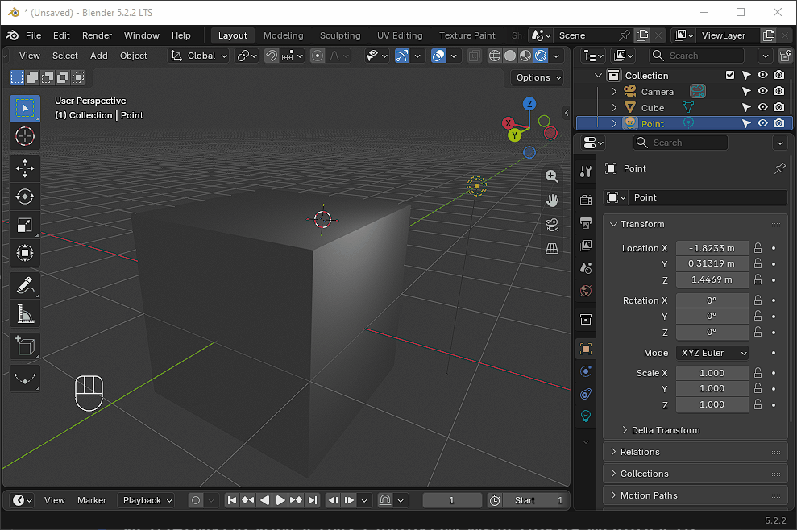
### Как включить отображение света

В режиме **Solid** свет не виден — модель освещена условно. Чтобы увидеть свои источники:

1. Нажми `Z` и выбери **Rendered**, либо нажми крайнюю правую сферу в правом верхнем углу вьюпорта.
2. Если работаешь в режиме **Material Preview**, открой стрелку рядом со сферами и включи **Scene Lights** и **Scene World** — иначе вместо твоих источников используется встроенное освещение.

> Сцена чёрная в режиме Rendered? Значит, на ней нет источников или у них слишком маленькая мощность.

---

## 3. Пропорциональное редактирование

Обычно двигается только то, что выделено. С пропорциональным редактированием соседние точки тянутся следом — чем дальше от выделенного, тем слабее. Так удобно делать плавные формы: холм под постройкой, изогнутую крышу, сужающийся шпиль башни.

### Как включить

1. Перейди в режим редактирования — `Tab`.
2. Нажми `O` (английская буква). В шапке вьюпорта сверху по центру загорится синим значок с кружком и точкой.
3. Повторное нажатие `O` выключает режим.

<!-- GIF 9: включение пропорционального редактирования клавишей O, значок в шапке вьюпорта -->
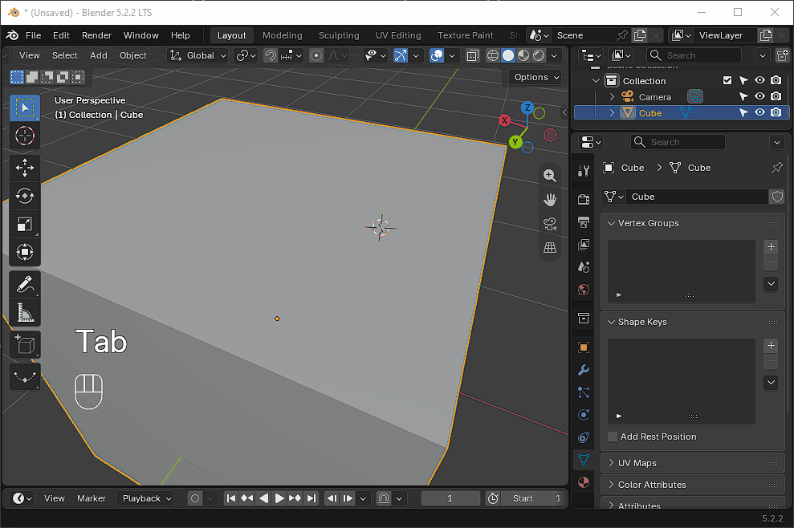
### Как пользоваться

1. Выдели точку, ребро или грань.
2. Начни действие: `G` — переместить, `R` — повернуть, `S` — масштабировать.
3. Вокруг курсора появится круг — это зона влияния. **Крути колесо мыши**, чтобы сделать её больше или меньше.
4. Подтверди левой кнопкой мыши.

<!-- GIF 10: перемещение вершины с пропорциональным редактированием, изменение радиуса колесом мыши -->
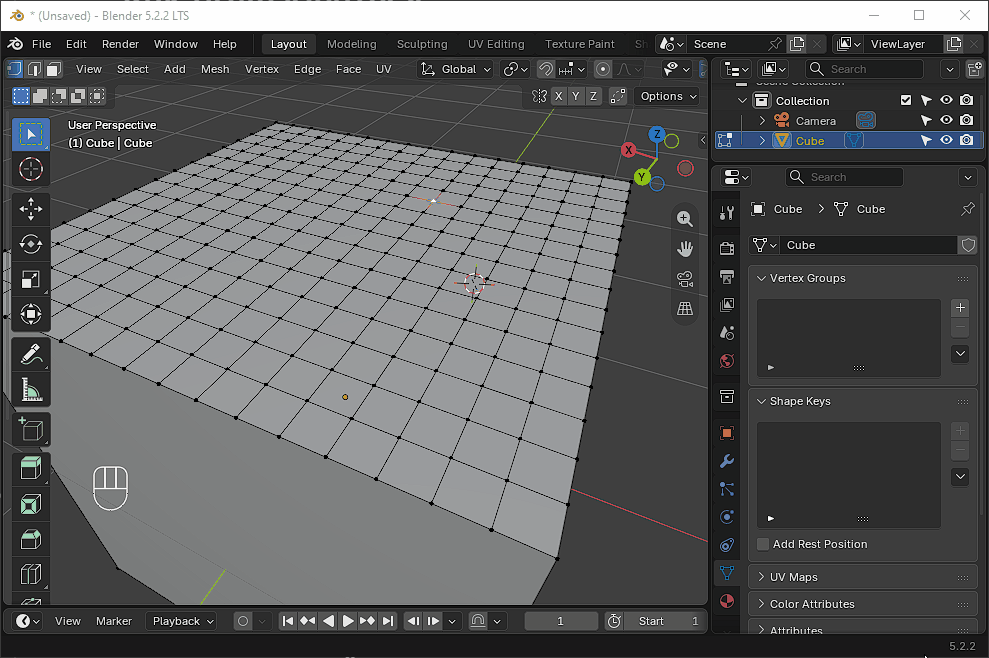
### Как настроить

- **Форма спада** — `Shift + O` или стрелка рядом со значком в шапке. **Smooth** даёт мягкий холм, **Sharp** — острый пик, **Linear** — ровный конус, **Constant** — двигает всё в круге одинаково.
- **Connected Only** — галочка в том же меню. С ней влияние идёт только по соединённой сетке и не задевает соседние отдельные части.

<!-- GIF 11: смена формы спада через Shift+O, сравнение Smooth и Sharp -->
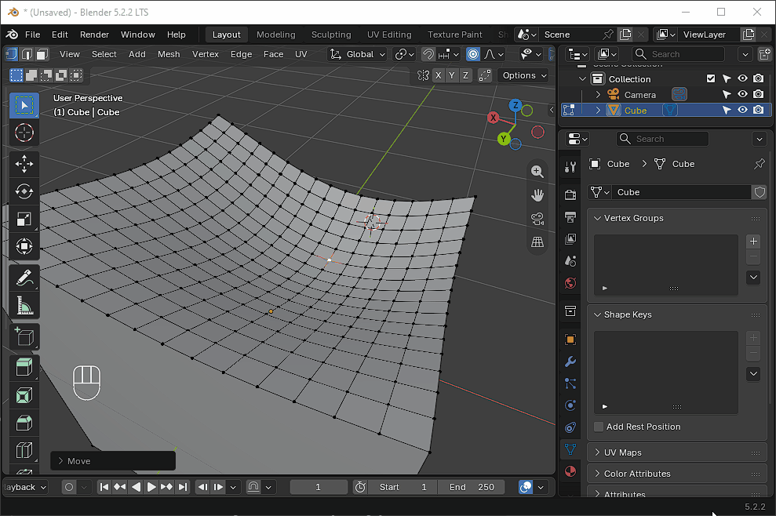
> **Вся модель поехала целиком?** Круг влияния слишком большой — уменьши его колесом мыши прямо во время движения.
>
> **Не забудь выключить** режим клавишей `O`, когда закончишь. Иначе при обычном моделировании точки будут тянуть за собой соседей.

---

## 4. Рендер

1. Найди удачный ракурс и нажми `Ctrl + Alt + Numpad 0` — камера встанет на текущий вид.
2. `Numpad 0` — посмотреть глазами камеры и проверить кадр.
3. `F12` — запустить рендер.
4. В окне рендера: **Image** → **Save As** (`Alt + S`) — сохранить картинку.

<!-- GIF 12: установка камеры на вид, рендер F12 и сохранение -->
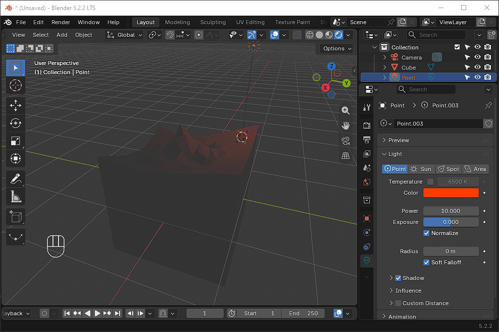
---

## Задание

Создай **набор построек для игры в жанре MOBA / Tower Defense** и сделай их рендер.

**Что нужно сделать:**

1. Найди 1–2 референса построек в понравившемся стиле и добавь их на сцену.
2. Смоделируй минимум **3 постройки** в едином стиле, например:
   - оборонительная башня;
   - главное здание базы (трон, нексус, цитадель);
   - казарма, стена с воротами или шахта ресурсов.
3. Расставь постройки на общей площадке. Хотя бы один элемент сделай с пропорциональным редактированием: неровный рельеф площадки, изогнутую крышу или шпиль.
4. Поставь минимум **2 источника света** разных типов и настрой их цвет и мощность.
5. Установи камеру и сделай рендер. Сохрани картинку в PNG.

**Усложнение по желанию:** добавь внутрь башни Point с цветным светом — получится светящийся кристалл или огонь.
