# Урок 3. Низкополигональное моделирование

**Курс:** Разработка 3D моделей и визуальных эффектов
**Версия программы:** Blender 4.3 и новее

Эта лекция повторяет то, что мы делали на уроке. Проходи её по порядку с открытым Blender: читаешь абзац, смотришь GIF, сразу повторяешь руками. В конце есть пошаговая сборка бочки, это и есть домашнее задание.

> **★ Звёздочка** отмечает дополнительный материал. При первом прохождении его можно пропускать, он пригодится позже. Всё, что без звёздочки, нужно для задания.

## Содержание

0. [Перед началом](#0-перед-началом)
1. [Low-poly и работа с примитивами](#1-low-poly-и-работа-с-примитивами)
2. [Основные инструменты моделирования](#2-основные-инструменты-моделирования)
3. [Луп, Loop Cut и Knife](#3-луп-loop-cut-и-knife)
4. [Контроль полигонов, пропорции и читаемость](#4-контроль-полигонов-пропорции-и-читаемость)
5. [Материалы](#5-материалы)
6. [Подготовка модели к доработке и текстурированию](#6-подготовка-модели-к-доработке-и-текстурированию)
7. [Задание: low-poly бочка для игры](#7-задание-low-poly-бочка-для-игры)
8. [Если что-то не работает](#8-если-что-то-не-работает)
9. [Шпаргалка по клавишам](#9-шпаргалка-по-клавишам)

---

## 0. Перед началом

Раскладка клавиатуры английская (EN), курсор мыши над 3D-вьюпортом. Почти все инструменты этого урока работают в **Edit Mode (Режим редактирования)**. Если клавиша делает что-то странное, первым делом проверь, в каком ты режиме.

### Что нужно помнить из урока 2

| Клавиша | Что делает |
|---|---|
| `G` / `R` / `S` + `X` / `Y` / `Z` | Перемещение / вращение / масштаб, с ограничением по оси |
| `Tab` | Object Mode ↔ Edit Mode |
| `1` / `2` / `3` | Вершины / рёбра / грани (в Edit Mode) |
| `Shift` + `A` | Добавить примитив |
| `F9` | Настройки последнего действия |

Если что-то из этого не помнишь, вернись к [лекции урока 2](Урок-1-Введение-В-Blender.md).

---

## 1. Low-poly и работа с примитивами

**Low-poly (Низкополигональная модель)** это модель из минимального количества полигонов, которая всё ещё хорошо читается по силуэту. Так делают модели для игр: чем меньше полигонов, тем быстрее работает игра. В уровне могут стоять сотни бочек, и каждая лишняя грань умножается на сотни.

<!-- 🎬 GIF-01 ЗАПИСАТЬ: рядом два цилиндра или две бочки — на 32 и на 10 сегментов, облёт вокруг, затем отдалить камеру: издалека разницы не видно. Желательно с включённой Statistics -->
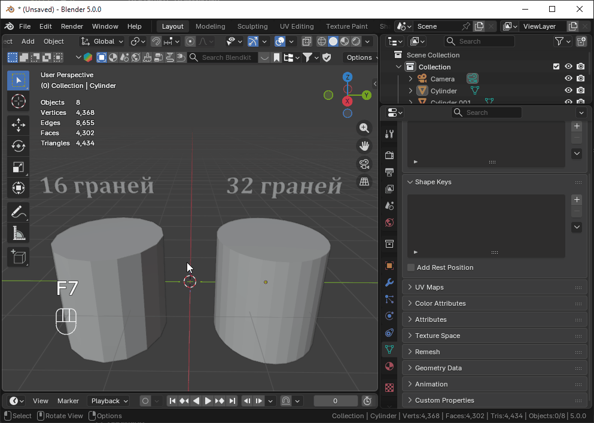

### Мало сегментов с самого начала

Убирать лишние полигоны потом долго. Проще сразу создать примитив с малым числом сегментов.

После `Shift + A` → **Cylinder** открой панель **Adjust Last Operation (Настроить последнюю операцию)** слева внизу и поставь **Vertices (Вершины)** = 8–12 вместо 32. У сферы за то же отвечают **Segments / Rings (Сегменты / Кольца)**.

Напоминание: панель работает только до следующего действия. Если она закрылась, нажми `F9`.

<!-- 🎬 GIF-02 ЗАПИСАТЬ: Shift+A → Cylinder, в панели слева внизу Vertices 32 → 12 → 8; затем UV Sphere, Segments 32 → 12, Rings 16 → 6 -->
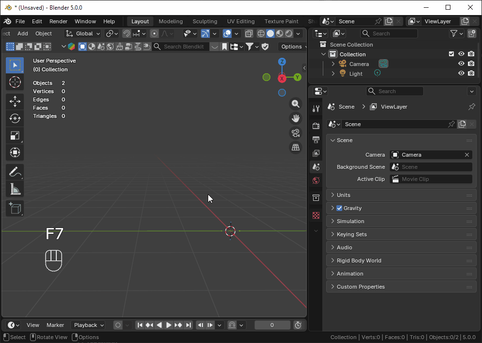

### Как считать полигоны

В шапке вьюпорта справа открой выпадающее меню **Overlays (Наложения)** и поставь галочку **Statistics (Статистика)**. В углу вьюпорта появится число вершин, рёбер, граней и треугольников.

Смотри на строку **Triangles (Треугольники)**. Игровой движок любую грань делит на треугольники, поэтому «вес» модели считают именно в них. Четырёхугольная грань это 2 треугольника.

<!-- 🎬 GIF-03 ЗАПИСАТЬ: открыть меню Overlays, включить Statistics, крупно показать появившиеся цифры; выделить объект — цифры меняются -->

### Режимы отображения

| Клавиша | English | Русский | Что делает |
|---|---|---|---|
| `Z` | Shading Pie Menu | Круговое меню затенения | Wireframe / Solid / Material Preview (Каркас / Твёрдотельный / Предпросмотр материала) |
| `Alt` + `Z` | Toggle X-Ray | Рентген | Видеть и выделять сквозь модель |
| ★ `Num /` | Local View | Локальный вид | Показать только выделенный объект. Ещё раз: вернуть всё |

**Рентген** нужен чаще, чем кажется. Без него рамка выделения берёт только то, что видно спереди, а задние вершины остаются невыделенными. С включённым `Alt + Z` выделяется всё насквозь.

<!-- 🎬 GIF-04 ЗАПИСАТЬ: Z → Wireframe, Z → Solid; затем в Edit Mode выделить рамкой верх цилиндра без X-Ray (повернуть — задние вершины не выделены), Alt+Z, выделить снова — выделено всё -->
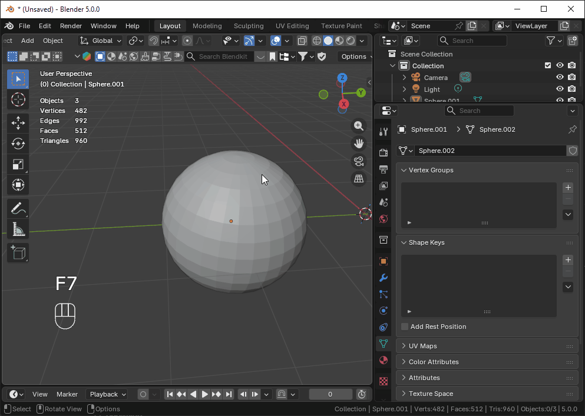

---

## 2. Основные инструменты моделирования

Low-poly модель почти целиком делается четырьмя действиями: выдавить, вставить, подвинуть, отмасштабировать.

| Клавиша | English | Русский | Что делает |
|---|---|---|---|
| `E` | Extrude | Выдавить | Вытянуть новые грани / рёбра из выделенного. `E` `Z` строго вверх |
| `I` | Inset Faces | Вставить грани | Вставить рамку-грань внутрь выделенной. `I` `I` каждой грани отдельно |
| `S` / `G` | Scale / Move | Масштаб / Перемещение | Для вершин, рёбер, граней. Так формируется силуэт |
| ★ `Ctrl` + `B` | Bevel | Фаска | Скосить острое ребро. Колёсико меняет число сегментов |
| ★ `S` `Z` `0` | Scale to zero | Масштаб в ноль | Выровнять вершины в одну плоскость по Z |

### Extrude: выдавить

Выдели грань, нажми `E` и двигай мышь. Из грани вырастает новый объём, а старая форма остаётся на месте. ЛКМ подтверждает. Как и с `G`, после `E` можно нажать ось и ввести число: `E` `Z` `1` выдавит ровно на метр вверх.

<!-- 🎬 GIF-05 ЗАПИСАТЬ: куб, Edit Mode, режим граней, выделить верхнюю грань, E — вытянуть вверх, ЛКМ; выделить боковую грань, E — вытянуть вбок -->
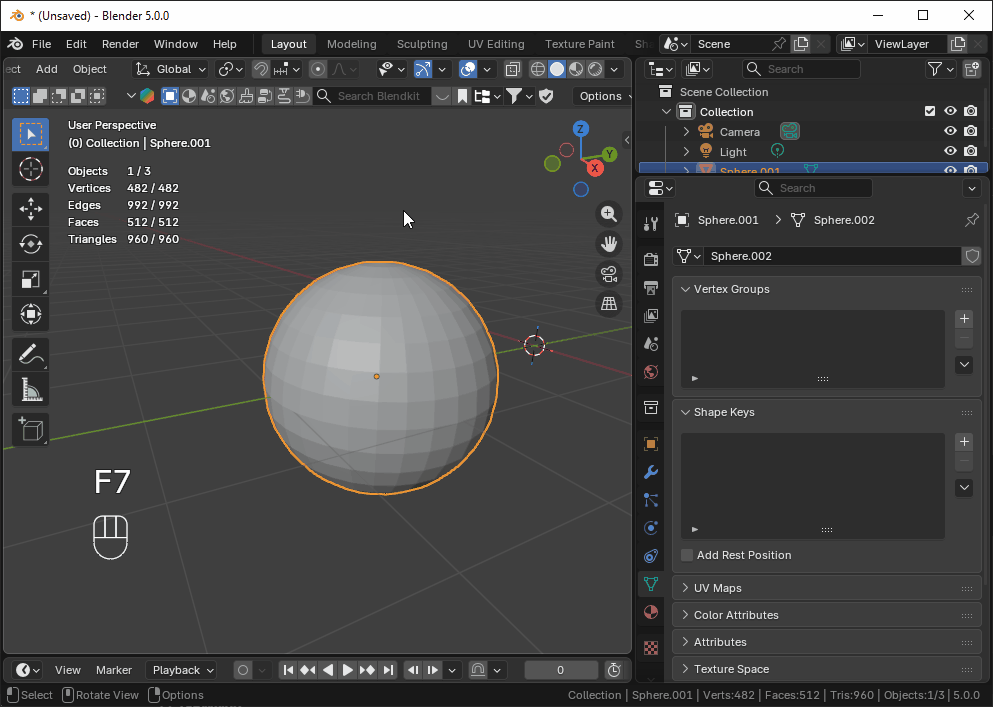

> **Типичная ошибка.** Нажал `E`, передумал и отменил движение через ПКМ или `Esc`. Движение отменилось, а новые грани уже созданы и лежат ровно на месте старых. Это называется двойная геометрия: её не видно, но она портит модель. Исправить сразу: `Ctrl + Z`. Если заметил поздно, поможет Merge by Distance из [раздела 4](#4-контроль-полигонов-пропорции-и-читаемость).

<!-- 🎬 GIF-06 ЗАПИСАТЬ: E на грани, ПКМ; затем G на этой грани — видно, что под ней осталась вторая такая же; Ctrl+Z несколько раз -->
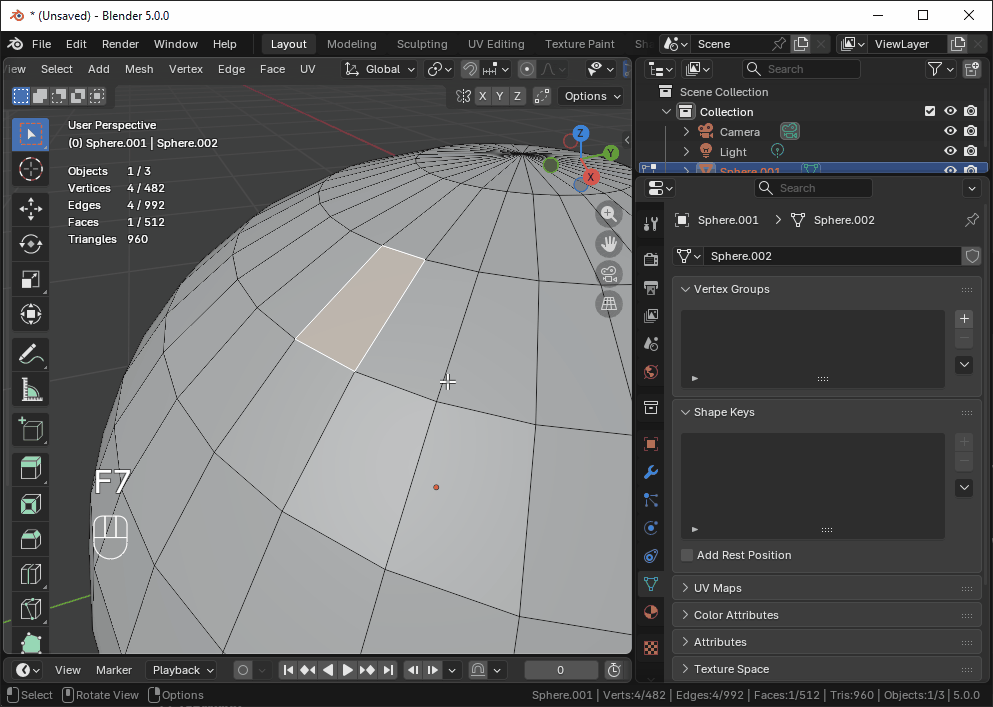

### Inset: вставить грань

Выдели грань, нажми `I` и двигай мышь. Внутри грани появляется такая же, но меньше, а между ними рамка. Обычно сразу после этого делают `E`: получается углубление или выступ. Так делают окна, двери, крышки, кнопки.

Если выделено несколько граней, `I` вставляет одну общую рамку. Нажми `I` ещё раз во время действия, и рамка появится у каждой грани отдельно.

<!-- 🎬 GIF-07 ЗАПИСАТЬ: куб, выделить грань, I — рамка, ЛКМ, затем E внутрь — углубление; потом выделить две соседние грани, I (общая рамка), нажать I ещё раз (отдельные рамки) -->
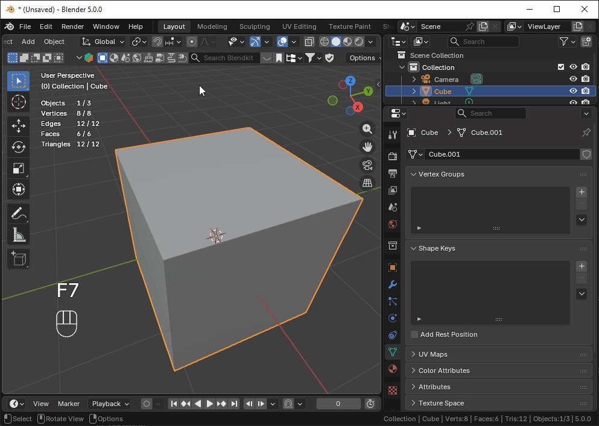

### Scale и Move: формируем силуэт

Те же `S` и `G`, что и на прошлом уроке, только применённые к частям модели. Сузить верхнюю грань цилиндра, раздвинуть рёбра, опустить вершину: так простая фигура превращается в узнаваемую.

<!-- 🎬 GIF-08 ЗАПИСАТЬ: цилиндр на 8–12 вершин, выделить верхнюю грань, S — сузить (получается ведро/кружка), G Z — поднять; E вверх, S — расширить -->
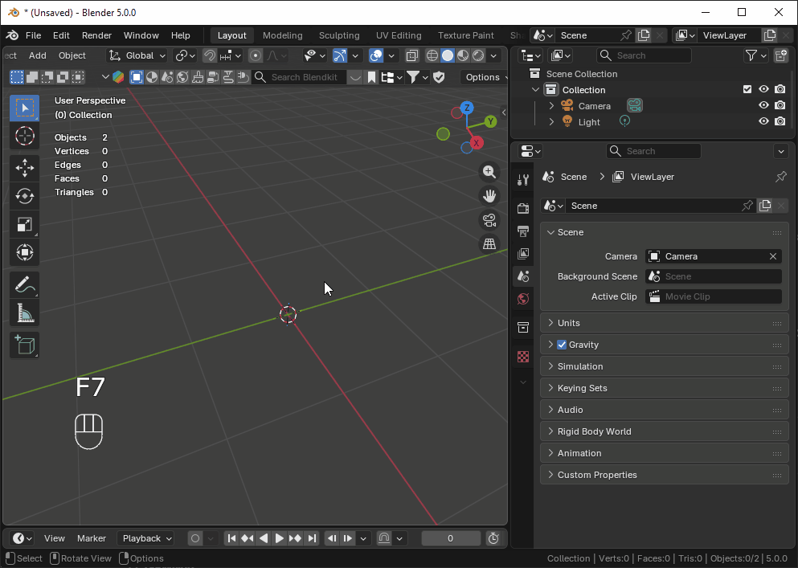

### ★ Дополнительно

**Bevel (Фаска).** Выдели ребро, `Ctrl + B`, двигай мышь. Острый угол срезается. Колёсико мыши добавляет сегменты, и срез становится скруглением. В low-poly обычно хватает одного сегмента.

<!-- 🎬 GIF-09 ЗАПИСАТЬ ★: куб, выделить ребро, Ctrl+B, потянуть, покрутить колёсико 1 → 3 сегмента, ЛКМ -->
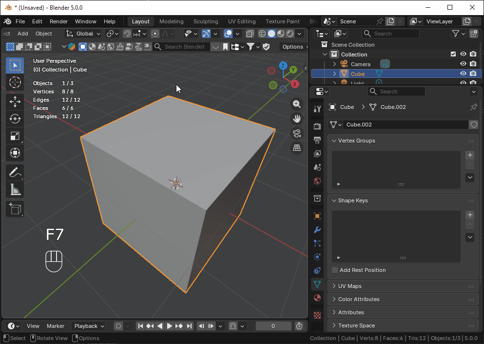

**Выровнять в плоскость.** Если вершины «гуляют» по высоте, выдели их и набери `S` `Z` `0` `Enter`. Масштаб в ноль по одной оси сплющивает выделенное в ровную плоскость.

<!-- 🎬 GIF-10 ЗАПИСАТЬ ★: несколько вершин на разной высоте, выделить, S Z 0 Enter — встали в одну плоскость -->
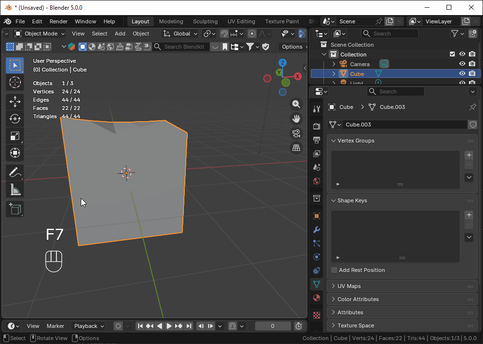

---

## 3. Луп, Loop Cut и Knife

### Что такое луп

**Edge Loop (Рёберная петля)**, или просто луп, это цепочка рёбер, которая идёт по кругу через всю модель. На цилиндре это горизонтальное «кольцо».

Лупы задают форму. Между двумя лупами поверхность прямая, изогнуться она может только на самом лупе. Добавил луп, и появилось место, где можно сделать изгиб.

| Клавиша | English | Русский | Что делает |
|---|---|---|---|
| `Alt` + `ЛКМ` по ребру | Select Loop | Выделить петлю | Выделить весь луп целиком |
| `Shift` + `Alt` + `ЛКМ` | Extend Loop | Добавить петлю | Добавить ещё один луп к выделению |
| ★ `Ctrl` + `Alt` + `ЛКМ` | Select Ring | Выделить кольцо рёбер | «Поперечные» рёбра (Edge Ring) |

В режиме граней (`3`) `Alt + ЛКМ` выделяет целый пояс граней. Направление пояса зависит от того, ближе к какому ребру грани ты кликнул: пояс пойдёт через это ребро.

<!-- 🎬 GIF-11 ЗАПИСАТЬ: цилиндр с несколькими лупами; в режиме рёбер Alt+ЛКМ по горизонтальному ребру — кольцо; Shift+Alt+ЛКМ — второе кольцо; Alt+ЛКМ по вертикальному ребру; затем режим граней, Alt+ЛКМ — пояс граней -->
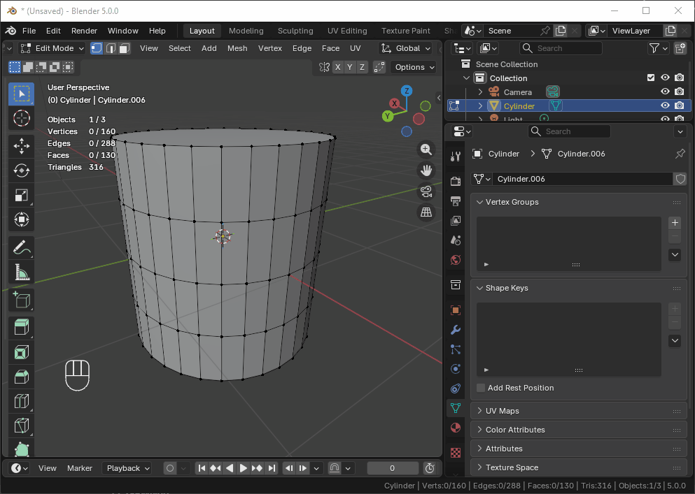

### Loop Cut: добавить луп

**Loop Cut and Slide (Петлевой разрез и сдвиг)**, клавиша `Ctrl + R`. Добавляет новый луп поперёк модели.

| Шаг / клавиша | Что делает |
|---|---|
| Навести на ребро | Жёлтая линия показывает, где пройдёт разрез |
| Колёсико мыши (или ввести цифру) | Сколько лупов добавить за раз |
| `ЛКМ` (1-й раз) | Подтвердить разрез. Дальше мышью сдвигаешь луп вдоль модели |
| `ЛКМ` (2-й раз) | Зафиксировать луп там, куда сдвинул |
| `ПКМ` вместо 2-го клика | Оставить луп ровно посередине |
| ★ `G` `G` | Edge Slide (Скольжение ребра): сдвинуть уже существующий луп вдоль модели |

Разрез идёт **поперёк** того ребра, на которое ты навёл мышь. Чтобы получить горизонтальное кольцо на цилиндре, наводи на вертикальное ребро.

Здесь ПКМ не отменяет разрез, а только сдвиг: луп остаётся, просто встаёт по центру. Чтобы убрать его совсем, нажми `Ctrl + Z`.

<!-- 🎬 GIF-12 ЗАПИСАТЬ: цилиндр, Ctrl+R, навести на вертикальное ребро (жёлтая линия), ЛКМ, сдвинуть, ЛКМ; ещё раз Ctrl+R, колёсиком сделать 3 разреза, ЛКМ, ПКМ — встали ровно -->
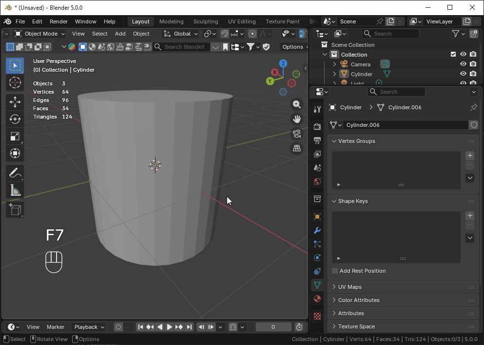

Теперь главный приём: выдели новый луп (`Alt + ЛКМ`) и нажми `S`. Цилиндр получает «пузо» или «талию».

<!-- 🎬 GIF-13 ЗАПИСАТЬ: цилиндр с лупом посередине, Alt+ЛКМ по лупу, S — раздуть (бочка), Ctrl+Z, S — сузить (песочные часы) -->
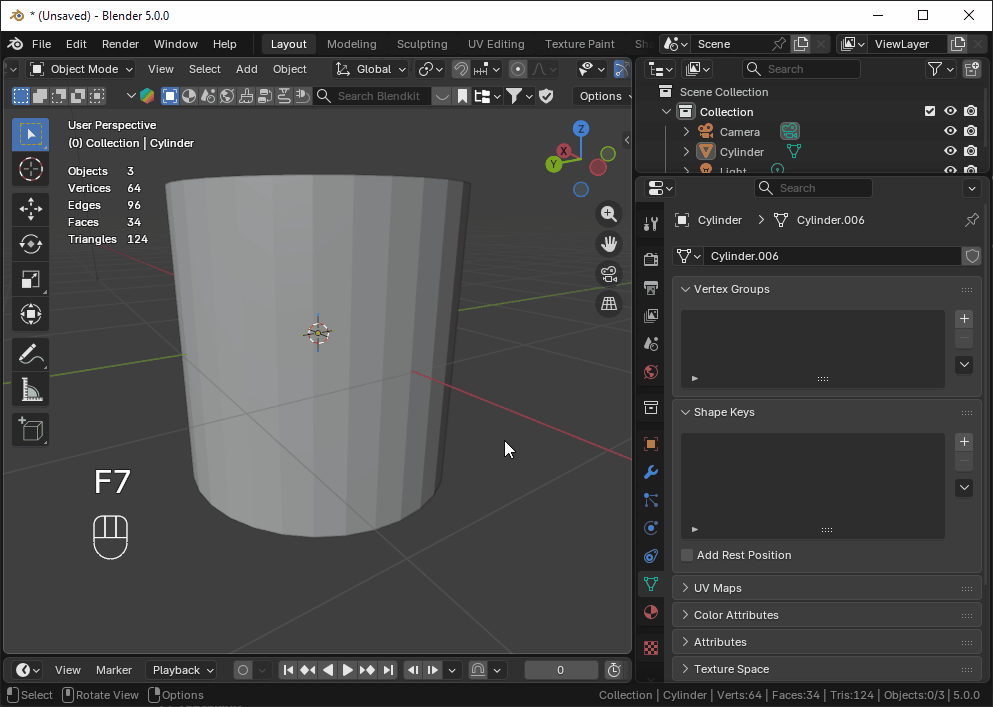

<!-- 🎬 GIF-14 ЗАПИСАТЬ ★: выделить существующий луп, G G — он скользит вдоль модели, форма не ломается; для сравнения G Z на наклонной поверхности -->
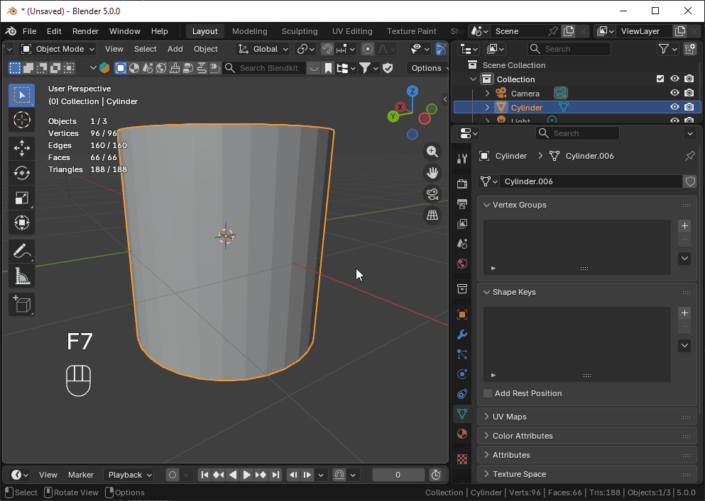

### Knife: нож

**Knife (Нож)**, клавиша `K`. Разрезает полигоны по линии, которую ты рисуешь сам. Нужен там, где Loop Cut не подходит: разрез не по кругу, а наискосок или только по одной грани.

Порядок работы: `K`, кликаешь ЛКМ точки разреза, в конце `Enter`.

| Клавиша (в режиме ножа) | English | Русский | Что делает |
|---|---|---|---|
| `ЛКМ` клик / тянуть | Add cut point | Точка разреза | Ставить точки разреза / резать протяжкой |
| `Enter` / `Space` | Confirm | Подтвердить | Применить разрез |
| `ПКМ` / `Esc` | Cancel | Отменить | Выйти без разреза |
| `E` | New Cut | Новый разрез | Начать новую линию, не выходя из ножа |
| ★ `Ctrl` | Midpoint Snap | Привязка к середине | Резать точно через середину ребра |
| ★ `Shift` | Ignore Snap | Без привязки | Свободная точка, без прилипания к вершинам |
| ★ `C` | Cut Through | Резать насквозь | Разрезать и задние грани модели тоже |
| ★ `A` | Angle Constraint | Ограничение угла | Резать под углами с шагом 30° |
| ★ `X` / `Y` / `Z` | Axis Constraint | Ограничение по оси | Резать строго вдоль оси |

Запоминать таблицу не нужно. Пока нож активен, подсказки всех клавиш видны в строке состояния внизу окна Blender.

Без `Enter` разрез не применится. Если просто кликнуть мимо или нажать `Esc`, всё нарисованное пропадёт.

<!-- 🎬 GIF-15 ЗАПИСАТЬ: куб, K, три-четыре клика по грани от ребра до ребра, Enter; в кадре должна быть видна строка состояния внизу с подсказками -->
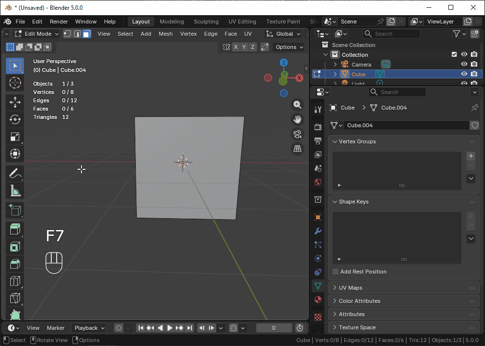

<!-- 🎬 GIF-16 ЗАПИСАТЬ ★: K, с зажатым Ctrl клик по серединам двух рёбер; E — новая линия; C — насквозь, показать с обратной стороны, что разрез прошёл -->
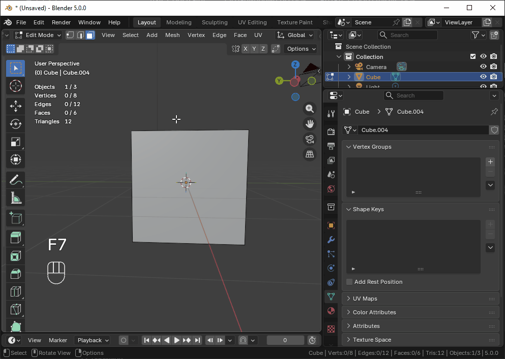

---

## 4. Контроль полигонов, пропорции и читаемость

### Убираем лишнее

| Клавиша | English | Русский | Что делает |
|---|---|---|---|
| `X` → Dissolve Edges | Dissolve Edges | Растворить рёбра | Убрать лишние рёбра без дыры |
| `X` → Faces | Delete Faces | Удалить грани | Удалить грани, которые никто не увидит (дно) |
| ★ `M` → By Distance | Merge by Distance | Объединить по расстоянию | Склеить вершины в одной точке (лечит двойную геометрию) |

В меню `X` есть два похожих пункта, и разница между ними важная:

- **Edges (Рёбра)** удаляет ребро вместе с гранями, которые на нём держались. Остаётся дыра.
- **Dissolve Edges (Растворить рёбра)** убирает ребро, а соседние грани сливает в одну. Дыры нет.

Чтобы убрать лишний луп, выдели его (`Alt + ЛКМ`) и выбери `X` → Dissolve Edges.

<!-- 🎬 GIF-17 ЗАПИСАТЬ: цилиндр с лупом, выделить луп, X → Edges — дыра; Ctrl+Z; X → Dissolve Edges — луп исчез, поверхность цела. В кадре Statistics, чтобы было видно, как падает число треугольников -->
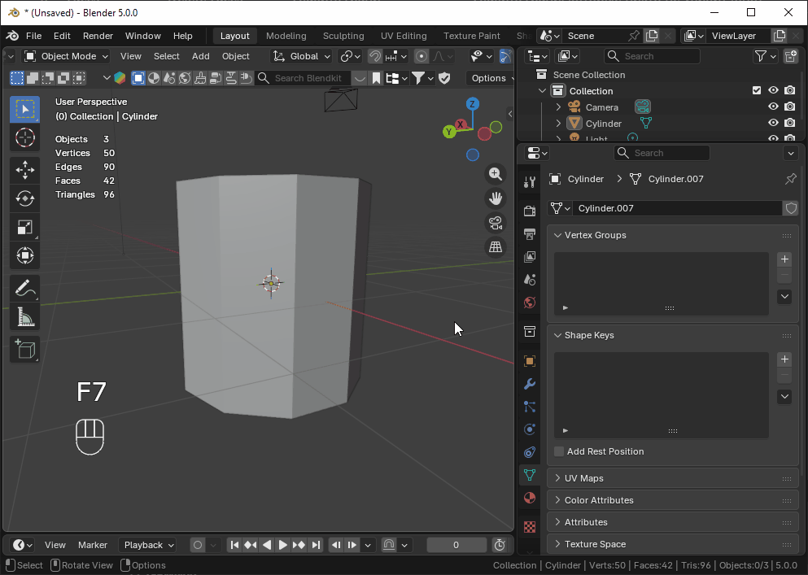

Грани, которые игрок никогда не увидит, можно удалить совсем. Дно бочки, стоящей на земле, или задняя стенка шкафа у стены.

<!-- 🎬 GIF-18 ЗАПИСАТЬ: повернуть модель дном вверх, выделить нижнюю грань, X → Faces; показать изменение в Statistics -->

★ **Merge by Distance.** Выдели всё (`A`), нажми `M` → By Distance. Вершины, лежащие в одной точке, склеятся в одну. В строке состояния внизу появится сообщение, сколько вершин удалено. Если там не ноль, двойная геометрия была.

<!-- 🎬 GIF-19 ЗАПИСАТЬ ★: модель с двойной геометрией (E + ПКМ), A, M → By Distance; крупно сообщение «Removed N vertices» внизу -->
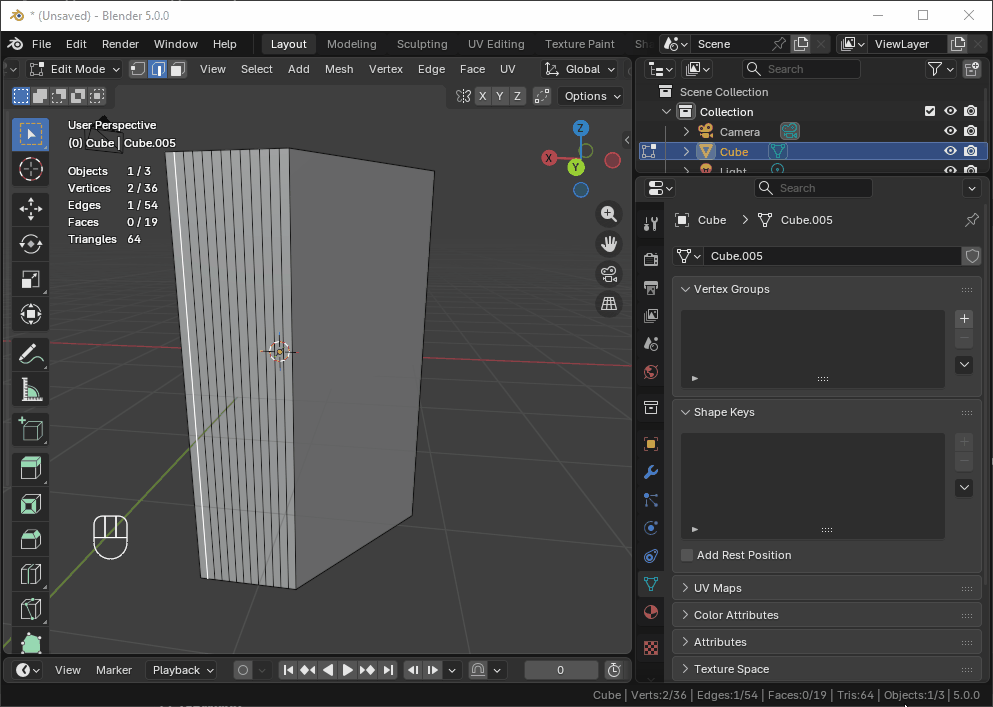

### Куда тратить полигоны

> **Правило:** полигоны тратим туда, где они меняют силуэт.

Плоская стенка может быть одной гранью, сколько её ни режь, выглядеть она будет так же. А круглому краю нужно 8–12 сегментов, иначе он превратится в гайку. Перед каждым новым лупом спроси себя: изменится ли от него контур модели? Сверяйся со Statistics.

### Пропорции

**1 клетка сетки = 1 метр.** Модели делают в реальных размерах, иначе в игре бочка окажется размером с дом.

Удобная проверка: поставь рядом куб высотой 1,8 м, это «человечек». Сразу видно, по пояс ли ему бочка и дотянется ли он до ручки двери.

<!-- 🎬 GIF-20 ЗАПИСАТЬ: рядом с моделью добавить куб, задать ему размеры примерно 0.5 × 0.3 × 1.8 м (N → Item → Dimensions), поставить на пол; сравнить с бочкой -->
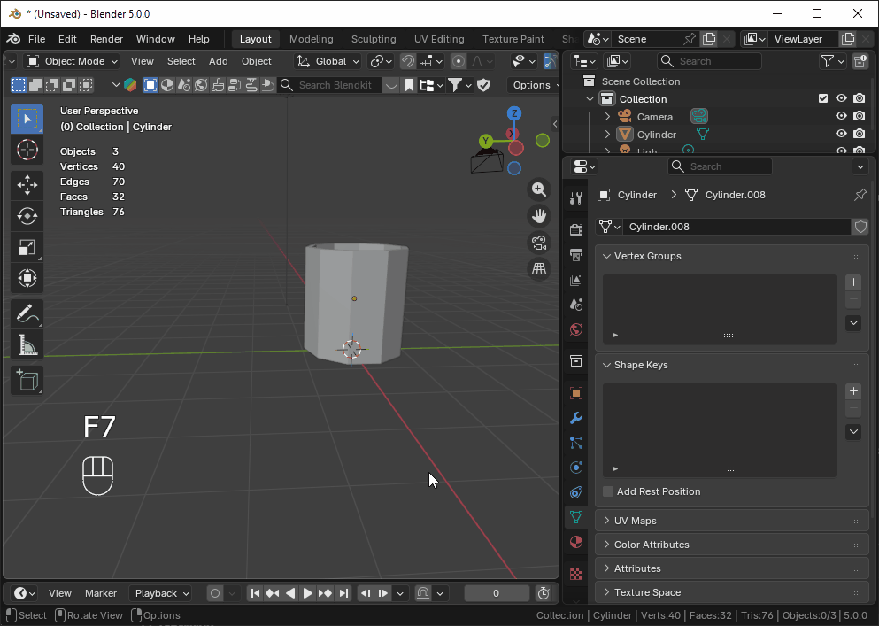

### Читаемость

Хорошая low-poly модель узнаётся по силуэту, даже когда она маленькая. Проверяй так:

- посмотри в ортографии спереди, сбоку и сверху (`Num 1` / `Num 3` / `Num 7`);
- отдали камеру так, чтобы модель стала размером с ноготь. Всё ещё понятно, что это?

Важные детали (обручи, ручки, края) лучше немного преувеличить. В реальности обруч на бочке почти не выступает, но в игре такой обруч просто исчезнет.

<!-- 🎬 GIF-21 ЗАПИСАТЬ: готовая модель, Num 1, Num 3, Num 7, затем сильно отдалить камеру — силуэт всё ещё читается -->
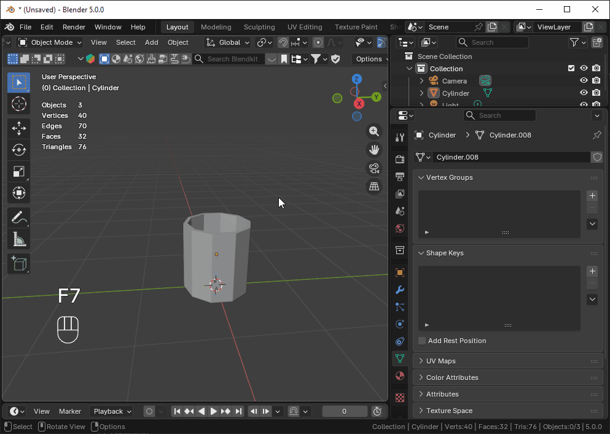

---

## 5. Материалы

**Material (Материал)** это описание поверхности объекта: цвет, шероховатость, металл это или нет. У одного объекта может быть несколько материалов на разных гранях.

| Где / клавиша | English | Русский | Что делает |
|---|---|---|---|
| Properties → вкладка с шаром | Material Properties | Свойства материала | Создание и настройка материалов |
| Кнопка New | New Material | Создать | Создать новый материал |
| Surface → Base Color | Base Color | Базовый цвет | Изменить цвет материала |
| ★ Surface → Roughness / Metallic | Roughness / Metallic | Шероховатость / Металлический | Матовый ↔ глянец / не металл ↔ металл |
| `Z` → Material Preview | Material Preview | Предпросмотр материала | Видеть цвета во вьюпорте |

### Первый материал

1. Выдели объект в Object Mode.
2. В редакторе **Properties (Свойства)** справа внизу найди вкладку с красным шаром, это **Material Properties**. Она в самом низу столбика вкладок.
3. Нажми **New (Создать)**.
4. Кликни по полю **Base Color (Базовый цвет)** и выбери цвет.
5. Дважды кликни по названию материала и дай ему понятное имя, например `Wood`.

В обычном режиме Solid цвет материала не виден. Нажми `Z` и выбери **Material Preview**.

<!-- 🎬 GIF-22 ЗАПИСАТЬ: выделить объект, открыть вкладку Material (шар), New, выбрать коричневый в Base Color, переименовать в Wood; Z → Material Preview — цвет появился -->
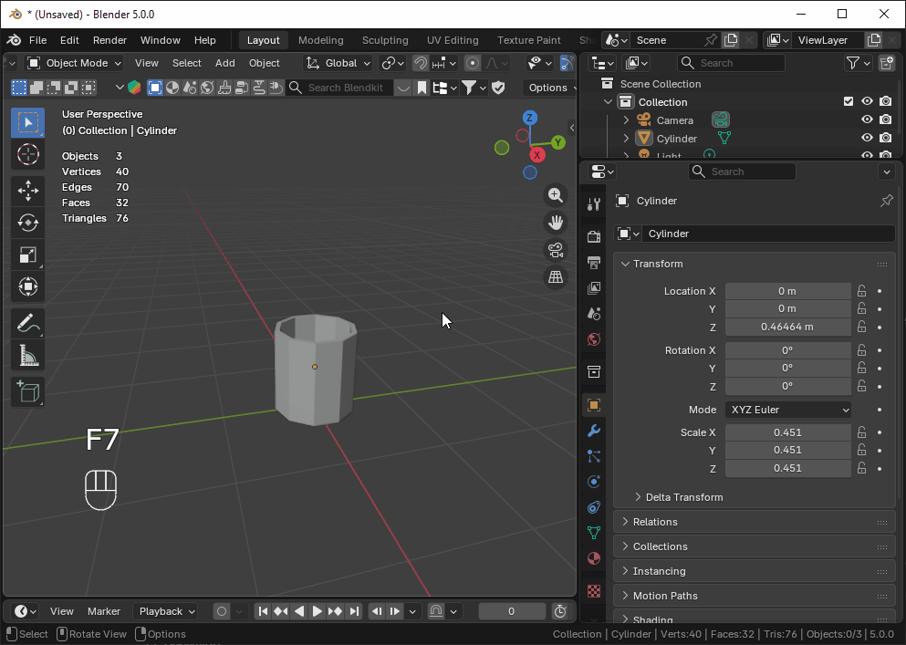

### Как покрасить отдельные полигоны

1. В списке материалов нажми **+** (Add Material Slot / Добавить слот материала) → **New (Создать)** → задай цвет и имя.
2. `Tab` → Edit Mode → `3` (грани) → выдели нужные грани. Удобно через `Alt + ЛКМ`: сразу целый пояс.
3. Выбери новый материал в списке и нажми **Assign (Назначить)**.

Кнопки **Assign / Select / Deselect** видны только в Edit Mode. Select и Deselect (Выделить / Снять) выделяют все грани с этим материалом, это удобно, чтобы проверить, что куда назначено.

Первый материал в списке получает весь объект целиком. Остальные работают только там, где ты нажал Assign.

<!-- 🎬 GIF-23 ЗАПИСАТЬ: объект с материалом Wood; «+», New, серый цвет, имя Metal; Tab, 3, Alt+ЛКМ по поясу граней, выбрать Metal в списке, Assign; затем Deselect и Select для показа -->
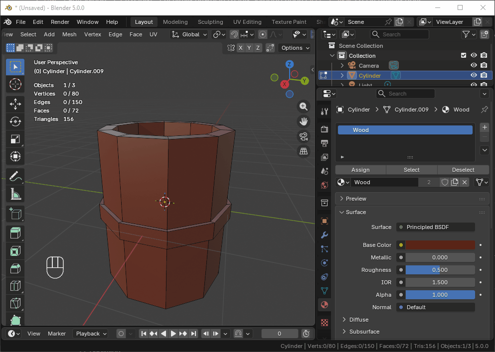

★ **Roughness (Шероховатость):** 0 даёт глянец, 1 полностью матовую поверхность. **Metallic (Металлический):** 0 для дерева, пластика, камня, 1 для металла. Промежуточные значения Metallic почти не используют.

<!-- 🎬 GIF-24 ЗАПИСАТЬ ★: в Material Preview подвигать ползунок Metallic 0 → 1, затем Roughness 1 → 0.2 на материале обручей -->
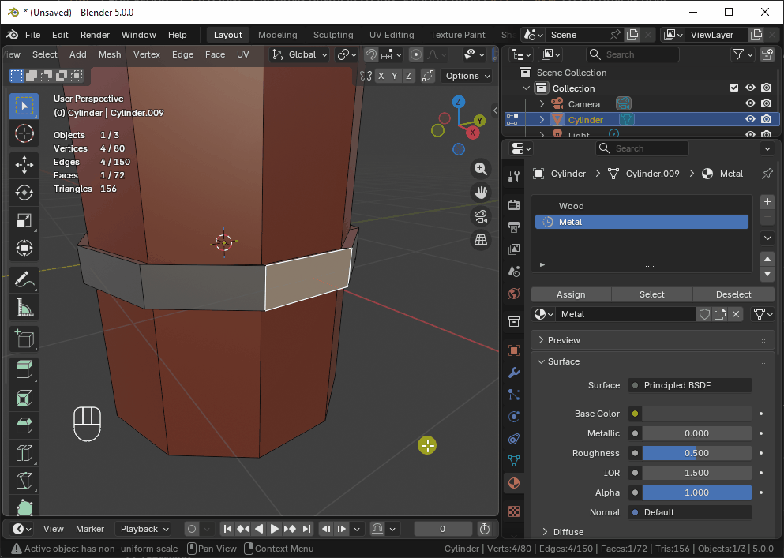

---

## 6. Подготовка модели к доработке и текстурированию

Четыре коротких действия, которые делают в конце работы над каждой моделью. Все в **Object Mode**, кроме последнего.

| Клавиша (Object Mode) | English | Русский | Что делает |
|---|---|---|---|
| `Ctrl` + `A` → Scale | Apply Scale | Применить масштаб | Масштаб = 1,0, иначе искажаются фаски и текстуры |
| `ПКМ` → Shade Flat / Shade Auto Smooth | Shade Flat / Auto Smooth | Плоское / Автосглаживание | Грани-«фасетки» или сглаживание круглых частей |
| `F2` | Rename | Переименовать | Понятное имя: «Barrel», а не «Cylinder.003» |
| ★ `Ctrl` + `J` | Join | Объединить | Собрать объекты в одну модель |
| ★ `Shift` + `N` (Edit Mode) | Recalculate Outside | Пересчитать наружу | Развернуть нормали граней наружу |

### Применить масштаб

Когда ты масштабируешь объект в Object Mode, Blender запоминает: «этот объект растянут в 2 раза по Z». Форма выглядит правильно, но инструменты считают по исходным размерам, поэтому фаски выходят кривыми, а текстуры растянутыми.

`Ctrl + A` → **Scale** говорит Blender: считай нынешний размер настоящим. Форма не меняется, а значения Scale в панели `N` становятся 1,0.

<!-- 🎬 GIF-25 ЗАПИСАТЬ: объект, растянутый в Object Mode; N → Item, показать Scale не равный 1; Ctrl+A → Scale; значения стали 1.000, форма не изменилась -->
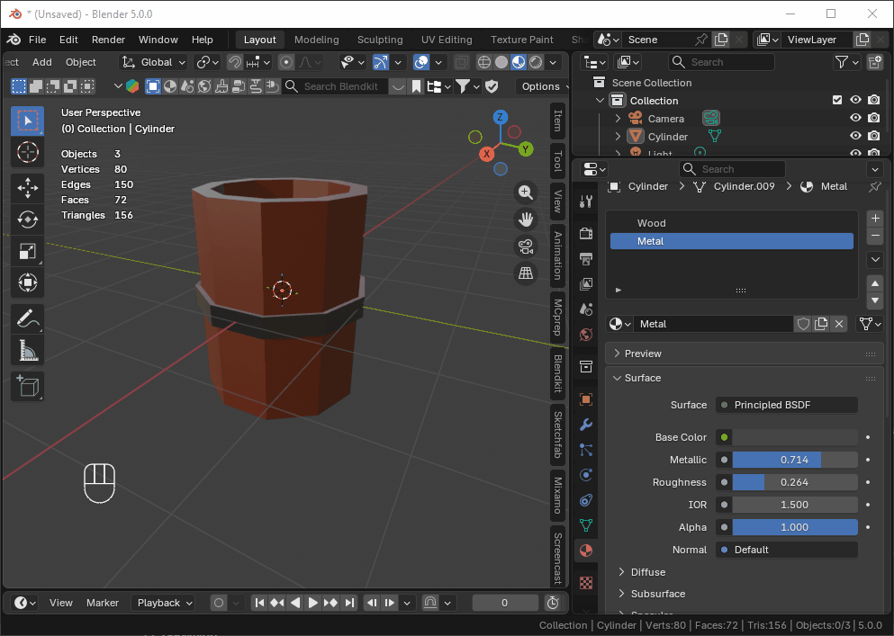

### Сглаживание

ПКМ по объекту в Object Mode открывает меню, в нём:

- **Shade Flat (Плоское затенение):** каждая грань видна отдельно, «фасетками». Классический low-poly вид.
- **Shade Auto Smooth (Автосглаживание):** круглые части выглядят гладкими, а острые углы остаются острыми.

Количество полигонов от этого не меняется, меняется только то, как на модель ложится свет.

<!-- 🎬 GIF-26 ЗАПИСАТЬ: ПКМ → Shade Auto Smooth, покрутить модель; ПКМ → Shade Flat; в кадре Statistics — число треугольников не меняется -->

### Имя

`F2` и вводишь имя. Когда в сцене окажется сорок объектов, искать нужный среди `Cylinder.003` и `Cube.017` будет очень неприятно.

<!-- 🎬 GIF-27 ЗАПИСАТЬ: F2, ввести Barrel, Enter; показать новое имя в Outliner справа вверху -->
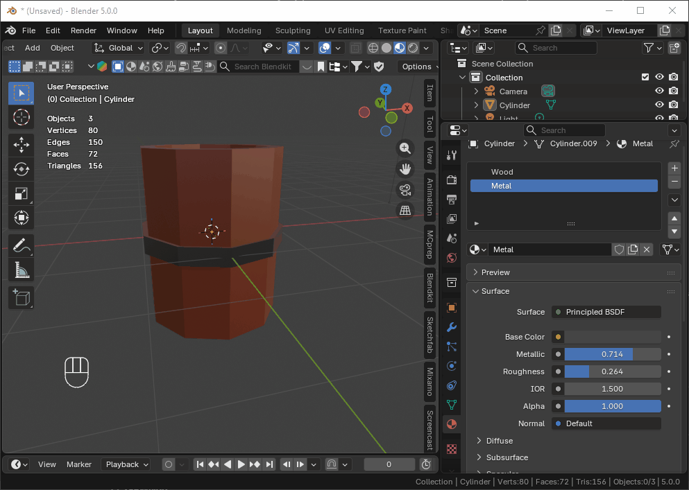

### ★ Дополнительно

**Join.** Если модель собрана из нескольких объектов, выдели их все и нажми `Ctrl + J`. Получится один объект. Материалы сохранятся.

**Нормали.** У каждой грани есть лицевая и изнаночная сторона. Если грань вывернута, она выглядит тёмной, а в игре может стать невидимой. В Edit Mode выдели всё (`A`) и нажми `Shift + N`: Blender развернёт все грани лицом наружу. Проверить можно в Overlays → **Face Orientation**: синее снаружи правильно, красное нет.

<!-- 🎬 GIF-28 ЗАПИСАТЬ ★: Overlays → Face Orientation, на модели видна красная грань; Tab, A, Shift+N — всё стало синим; выключить Face Orientation -->
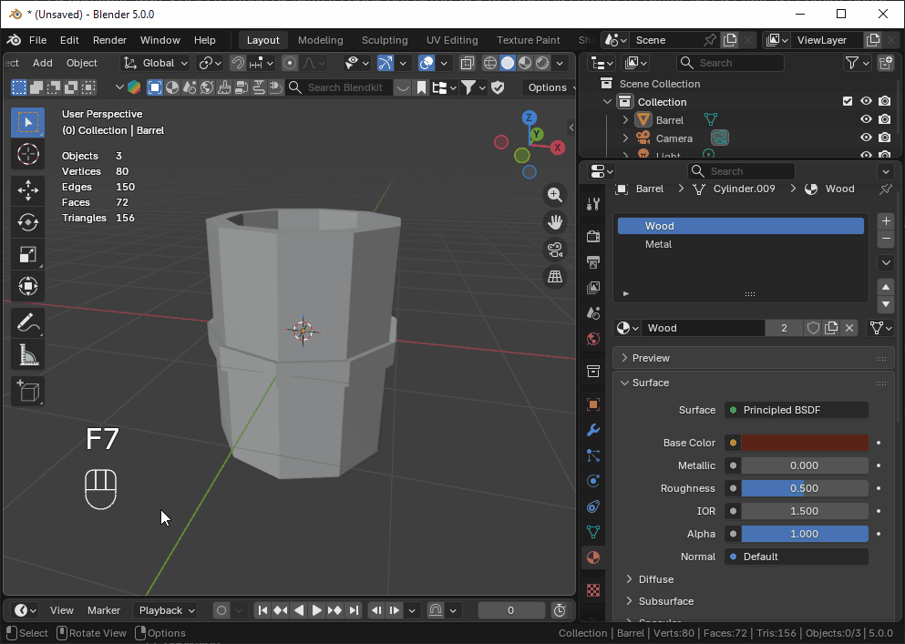

---

## 7. Задание: low-poly бочка для игры

Смоделируй игровой **пропс (Prop / Реквизит)**, то есть предмет окружения для 3D-проекта. Выбери один из вариантов.

<!-- 🎬 GIF-29 ЗАПИСАТЬ: ускоренная запись сборки бочки по шагам ниже, 20–30 секунд, в конце облёт готовой модели в Material Preview -->

### Вариант 1. Low-poly бочка

Короткий путь:

> Cylinder на 8–12 вершин → `Ctrl + R` лупы → `S` лупов, «пузо» бочки → `I` + `E` на крышке, углубление → обручи: выделить пояс граней и `E` / `S` → два материала: дерево и металл.

То же самое подробно. Числа примерные, подбирай на глаз.

**Шаг 1. Основа.** `Shift + A` → Mesh → Cylinder. В панели слева внизу: Vertices `12`, Radius `0.4`, Depth `1`. Подними на пол: `G` `Z` `0.5` `Enter`.

**Шаг 2. Лупы.** `Tab`. Нажми `Ctrl + R`, наведи на вертикальное ребро, колёсиком сделай 3 разреза, `ЛКМ`, затем `ПКМ`, чтобы они встали ровно.

**Шаг 3. Пузо.** Сразу после разреза все три лупа выделены. `S` `1.2` `Enter`. Затем нажми `2`, выдели только средний луп (`Alt + ЛКМ` по его ребру) и увеличь ещё немного: `S` `1.08` `Enter`.

<!-- 🎬 GIF-30 ЗАПИСАТЬ: шаги 1–3 в реальном темпе: цилиндр на 12 вершин, Ctrl+R ×3, S 1.2, средний луп S 1.08 -->

**Шаг 4. Место под обручи.** `Ctrl + R`, наведи на вертикальное ребро в самом верхнем поясе, `ЛКМ`, сдвинь луп ближе к верхнему краю, `ЛКМ`. Получился узкий пояс граней у края. Повтори то же в самом нижнем поясе.

**Шаг 5. Обручи.** Нажми `3`. `Alt + ЛКМ` по грани верхнего узкого пояса (кликай ближе к её боковому, вертикальному ребру), затем `Shift + Alt + ЛКМ` по нижнему поясу. Теперь `E`, сразу `S`, затем `Shift + Z` и чуть отведи мышь, чтобы обручи выступили наружу. `ЛКМ`.

★ Другой способ для этого шага: `Alt + E` → Extrude Faces Along Normals.

<!-- 🎬 GIF-31 ЗАПИСАТЬ: шаги 4–5: два Loop Cut у краёв, выделение двух поясов граней, E → S → Shift+Z, обручи выступили -->

**Шаг 6. Крышка.** Выдели верхнюю грань. `I`, слегка сдвинь мышь, `ЛКМ`. Затем `E` `Z` `-0.05` `Enter`. Получилось углубление.

**Шаг 7. Дно.** Поверни вид снизу, выдели нижнюю грань, `X` → Faces. Бочка стоит на земле, дно никто не увидит.

<!-- 🎬 GIF-32 ЗАПИСАТЬ: шаги 6–7: I и E Z -0.05 на крышке, удаление дна -->

**Шаг 8. Материалы.** `Tab` в Object Mode. Создай материал `Wood` с коричневым цветом. Добавь второй слот (`+`), создай `Metal` с серым цветом. `Tab`, `3`, выдели грани обручей (`Alt + ЛКМ` и `Shift + Alt + ЛКМ`), выбери `Metal`, нажми Assign. `Z` → Material Preview, чтобы увидеть результат.

**Шаг 9. Финиш.** `Tab` в Object Mode. `Ctrl + A` → Scale. `ПКМ` → Shade Flat или Shade Auto Smooth, как больше нравится. `F2` → `Barrel`. Посмотри в Statistics на число треугольников. `Ctrl + S`.

<!-- 🎬 GIF-33 ЗАПИСАТЬ: шаги 8–9: два материала, Assign на обручи, Material Preview, Ctrl+A → Scale, F2 → Barrel, показать Triangles в Statistics -->

### Вариант 2. Свой пропс

Сундук, ящик, факел, фонарь, стол, указатель, ведро, бочка с TNT: любой предмет для твоего 3D-проекта.

### Что должно получиться

- [ ] Модель читается по силуэту
- [ ] Не больше 500 треугольников (смотри Statistics)
- [ ] Использованы Extrude, Inset и Loop Cut
- [ ] Минимум 2 материала
- [ ] Применён масштаб (`Ctrl + A` → Scale)
- [ ] У объекта понятное имя
- [ ] Файл сохранён (`Ctrl + S`)

---

## 8. Если что-то не работает

| Проблема | Причина и решение |
|---|---|
| `E`, `I`, `Ctrl + R`, `K` не работают | Ты в Object Mode. Выдели объект и нажми `Tab` |
| `Ctrl + R` не показывает жёлтую линию | Наведи мышь прямо на ребро модели. На гранях с числом углов не 4 (например, на крышке цилиндра) луп не проходит |
| Луп идёт не в ту сторону | Разрез идёт поперёк ребра, на которое наведена мышь. Наведи на ребро другого направления |
| `Alt + ЛКМ` выделяет не тот луп | Кликай точно по ребру нужного лупа. В режиме граней кликай ближе к ребру, через которое должен пойти пояс |
| `Alt + ЛКМ` двигает окно вместо выделения (Linux) | Клавишу Alt перехватывает система. Отключи это в настройках системы или включай Emulate 3 Button Mouse только при необходимости, с ней `Alt + ЛКМ` тоже занято |
| Рамка выделила только переднюю сторону | Включи рентген: `Alt + Z` |
| После `X` в модели дыра | Выбран Edges или Vertices вместо Dissolve. `Ctrl + Z` и выбери Dissolve Edges |
| Грани мерцают, на модели тёмные пятна | Двойная геометрия. В Edit Mode: `A`, затем `M` → By Distance |
| Грань тёмная или «вывернутая» | Нормаль смотрит внутрь. В Edit Mode: `A`, затем `Shift + N` |
| Нож ничего не разрезал | Разрез не подтверждён. После точек нажми `Enter` |
| Материал не виден | Ты в режиме Solid. `Z` → Material Preview |
| Нет кнопки Assign | Она появляется только в Edit Mode |
| Покрасилась вся модель, а не выделенные грани | Ты изменил цвет первого материала вместо создания второго. Добавь слот кнопкой `+`, создай новый материал и назначь его через Assign |
| Фаска (`Ctrl + B`) получается неровной | Не применён масштаб. Object Mode, `Ctrl + A` → Scale |
| В Statistics слишком много треугольников | Убери лупы, которые не меняют силуэт (`X` → Dissolve Edges), удали невидимые грани, в следующий раз начинай с меньшего числа сегментов |

---

## 9. Шпаргалка по клавишам

Основа урока, всё на одном экране. Edit Mode, если не сказано иначе.

| Действие | Клавиша |
|---|---|
| Статистика полигонов | Overlays → Statistics |
| Меню затенения | `Z` |
| Рентген | `Alt + Z` |
| Выдавить | `E` |
| Вставить грань | `I` |
| Выделить луп / добавить луп | `Alt + ЛКМ` / `Shift + Alt + ЛКМ` |
| Добавить луп | `Ctrl + R` |
| Нож | `K`, подтвердить `Enter` |
| Убрать ребро без дыры | `X` → Dissolve Edges |
| Удалить грань | `X` → Faces |
| Новый материал | Properties → вкладка с шаром → New |
| Назначить материал на грани | выбрать материал → Assign |
| Увидеть цвета | `Z` → Material Preview |
| Применить масштаб (Object Mode) | `Ctrl + A` → Scale |
| Сглаживание (Object Mode) | `ПКМ` → Shade Flat / Shade Auto Smooth |
| Переименовать (Object Mode) | `F2` |

Дополнительно ★:

| Действие | Клавиша |
|---|---|
| Локальный вид | `Num /` |
| Фаска | `Ctrl + B` |
| Выровнять в плоскость | `S` `Z` `0` |
| Выделить кольцо рёбер | `Ctrl + Alt + ЛКМ` |
| Скольжение ребра | `G` `G` |
| Склеить вершины | `M` → By Distance |
| Объединить объекты (Object Mode) | `Ctrl + J` |
| Развернуть нормали наружу | `Shift + N` |
